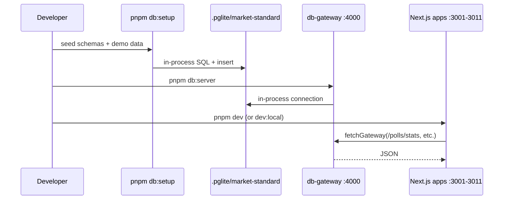

# Market Standard, LLC

Micro-SaaS portfolio by **Market Standard, LLC** — 11 production Standard apps + 2 Tier-B stubs + shared FloodG8 Supabase + single Stripe account + individual Vercel deploys. Deep FloodG8 + SyncDevTime synergy.

> **Note:** This README is being updated as the portfolio grows. The current state is 11 apps scaffolded with full marketing, billing, webhook, data layers, and E2E specs. See `docs/SAAS-FINISH.md` for the exhaustive finish checklist and `docs/SAAS_SUITE_INTEGRATION.md` (in the `floodg8` repo) for the cross-repo integration plan.

| Product | Description | Local port | Docs |
|---------|-------------|------------|------|
| [Standard Polls](apps/standard-polls) | Slack poll/survey bot + standup + suite digest | 3001 | [README](apps/standard-polls/README.md) · [STRATEGY](apps/standard-polls/STRATEGY.md) |
| [Standard Proof](apps/standard-proof) | Testimonial Wall of Love embeds | 3002 | [README](apps/standard-proof/README.md) · [STRATEGY](apps/standard-proof/STRATEGY.md) |
| [Standard Metrics](apps/standard-metrics) | Stripe subscription analytics + Connect + quota monitor | 3003 | [README](apps/standard-metrics/README.md) · [STRATEGY](apps/standard-metrics/STRATEGY.md) |
| [Standard Hook](apps/standard-hook) | Webhook debugger + inbox + replay | 3004 | (docs TODO — see SAAS-FINISH Phase 1.2) |
| [Standard Release](apps/standard-release) | GitHub release notes generator | 3005 | (docs TODO) |
| [Standard Vault](apps/standard-vault) | AI-agent-safe secrets manager | 3006 | (docs TODO) |
| [Standard Links](apps/standard-links) | Stripe Payment Link CRUD + click tracking | 3007 | (docs TODO) |
| [Standard Snippets](apps/standard-snippets) | Code snippet manager + sharing + versioning | 3008 | (docs TODO) |
| [Standard Status](apps/standard-status) | Build/CI status dashboard + incidents | 3009 | (docs TODO) |
| [Standard Regex](apps/standard-regex) | Regex pattern builder + debugger | 3010 | (docs TODO) |
| [Standard Postmortem](apps/standard-postmortem) | Blameless incident postmortem + recurrence | 3011 | (docs TODO) |
| Standard Lens (Tier-B) | DB query optimizer | 3012 | not yet built — see SAAS-FINISH Phase 6.1 |
| Standard Cron (Tier-B) | Cron monitor | 3013 | not yet built — see SAAS-FINISH Phase 6.2 |
| Standard Workspace (planned) | Multi-repo dev orchestrator | 3014 | see SAAS-FINISH Phase 11.2 |

## Purpose

This monorepo houses a **portfolio GTM strategy**: each product solves one job well, spreads the Market Standard brand through usage (powered-by badges, Slack footers, public pages), and shares infrastructure so all apps ship and operate cheaply on a single Supabase project + single Stripe account + individual Vercel deploys.

The portfolio pairs with two sibling repos:
- **FloodG8** (`F:\dev\floodg8`) — autonomous dev OS + cloud control plane that bundles all Standard apps via `PORTFOLIO_BUNDLE_MAP` entitlements on Team/Enterprise plans
- **Market Standard Agent Skill** (`F:\dev\agent-skill`) — open-source `ms-agent` CLI for Claude Code/Cursor/Codex that reports agent activity + AI token cost to FloodG8 Suite Pulse
- **MarketStandard marketing site** (`marketstandard-app` repo) — public homepage + Sanity-backed marketplace

Portfolio strategy: [docs/STRATEGY.md](docs/STRATEGY.md)  
Finish checklist: [docs/SAAS-FINISH.md](docs/SAAS-FINISH.md)  
Production deployment: [docs/DEPLOYMENT.md](docs/DEPLOYMENT.md)

## Tech stack

| Layer | Technology | Role |
|-------|------------|------|
| Monorepo | Turborepo + pnpm workspaces | Shared packages, independent deploys |
| Apps | Next.js 15 (App Router) | Marketing pages, dashboards, API routes |
| Hosting | Vercel (one project per app) | Serverless functions, cron, edge |
| Database | Supabase Postgres (prod, shared project `opodtvblrelmpoaprmpr`) / PGlite (local) | Per-product Postgres schemas |
| ORM | Drizzle | Type-safe schema, migrations |
| Billing | Stripe | Subscriptions + Connect OAuth (Metrics, Links) |
| Auth | Supabase Auth + Slack OAuth | Dashboard login, Slack install |
| UI | `@market-standard/ui` | Shared components + marketing one-pagers |
| E2E | Playwright | 21 specs covering all 11 apps + cross-app flows |
| Observability | Sentry + Vercel Analytics (planned) | Error tracking + product analytics |

## Repository structure

```
market-standard/
├── apps/
│   ├── standard-polls/        Slack Bolt bot + marketing + standup + digest cron
│   ├── standard-proof/        Testimonial dashboard + embeds + public pages
│   ├── standard-metrics/      Stripe Connect + analytics + quota monitor
│   ├── standard-hook/         Webhook debugger + inbox + replay
│   ├── standard-release/      GitHub release notes generator
│   ├── standard-vault/        AI-agent-safe secrets manager
│   ├── standard-links/        Stripe Payment Link CRUD + click tracking
│   ├── standard-snippets/     Code snippet manager + sharing + versioning
│   ├── standard-status/       Build/CI status dashboard + incidents
│   ├── standard-regex/        Regex pattern builder + debugger
│   └── standard-postmortem/   Blameless incident postmortem + recurrence
├── packages/
│   ├── auth/                  Supabase + Slack OAuth helpers
│   ├── billing/               Stripe checkout, webhooks, plan definitions (13 ProductIds)
│   ├── config/                Shared tsconfig, Tailwind preset, Biome
│   ├── db/                    Drizzle schemas (13 schemas), Supabase client, PGlite local dev
│   └── ui/                    Components, marketing landing system, portfolio URLs
├── e2e/                       21 Playwright specs + helpers + stack-constants
├── scripts/
│   ├── db-gateway.ts          Local PGlite HTTP gateway (port 4000)
│   ├── sync-local-env.ts      Writes .env.local per app for local dev
│   └── setup-vercel-envs.ts   Sets Vercel env vars per app via Vercel API
├── docs/
│   ├── STRATEGY.md            Portfolio strategy
│   ├── DEPLOYMENT.md          Vercel / Supabase / Stripe setup
│   └── SAAS-FINISH.md         Exhaustive finish checklist (this repo)
└── .pglite/                   Local persisted database (gitignored)
```

## Architecture (portfolio)

```mermaid
flowchart TB
  subgraph Clients
    Slack[Slack workspaces]
    Web[Customer websites]
    Merchants[Stripe merchants]
    Visitors[End users / visitors]
    IDE[Cursor + Claude Code]
  end

  subgraph Vercel["Vercel (11 projects)"]
    Polls[standard-polls :3001]
    Proof[standard-proof :3002]
    Metrics[standard-metrics :3003]
    Hook[standard-hook :3004]
    Release[standard-release :3005]
    Vault[standard-vault :3006]
    Links[standard-links :3007]
    Snippets[standard-snippets :3008]
    Status[standard-status :3009]
    Regex[standard-regex :3010]
    Postmortem[standard-postmortem :3011]
  end

  subgraph SharedPackages["Shared packages"]
    UI["@market-standard/ui"]
    DB["@market-standard/db"]
    Billing["@market-standard/billing"]
    Auth["@market-standard/auth"]
  end

  subgraph Data
    Supabase[(Supabase Postgres\nopodtvblrelmpoaprmpr)]
    Stripe[Stripe API]
    SlackAPI[Slack API]
  end

  subgraph SiblingRepos["Sibling repos"]
    FloodG8[FloodG8 cloud\nflood-g8.com]
    AgentSkill[ms-agent CLI\nF:\dev\agent-skill]
    MarketSite[marketstandard.app]
  end

  Slack --> Polls
  Visitors --> Proof
  Merchants --> Metrics & Links
  Web --> Proof
  IDE --> Vault & Snippets & Regex

  Polls & Proof & Metrics & Hook & Release & Vault & Links & Snippets & Status & Regex & Postmortem --> UI & DB & Billing & Auth

  DB --> Supabase
  Billing --> Stripe
  Auth --> Supabase
  Polls --> SlackAPI
  Metrics & Links --> Stripe
  FloodG8 --> Supabase
  AgentSkill --> FloodG8
  MarketSite --> FloodG8
```



## Local development architecture

Next.js apps cannot bundle PGlite (WASM path issues). Local dev uses a **standalone DB gateway** that owns PGlite in-process; apps read data via HTTP when `NEXT_PUBLIC_LOCAL_DEV=true`.



## Prerequisites

- **Node.js** 20+
- **pnpm** 9+ (`corepack enable && corepack prepare pnpm@9.15.0 --activate`)

## Quick start (local, no credentials)

Runs all 11 apps with seeded PGlite data — no Slack, Stripe, or Supabase keys required.

```bash
pnpm install
pnpm dev:local
```

| URL | What to check |
|-----|----------------|
| http://localhost:3001 | Standard Polls marketing page + live DB stats |
| http://localhost:3002 | Standard Proof marketing page + Wall of Love |
| http://localhost:3003 | Standard Metrics dashboard (MRR ~$12,400 from seed data) |
| http://localhost:3004 | Standard Hook dashboard + inboxes |
| http://localhost:3005 | Standard Release dashboard + repos |
| http://localhost:3006 | Standard Vault dashboard + projects |
| http://localhost:3007 | Standard Links dashboard + payment links |
| http://localhost:3008 | Standard Snippets dashboard + snippet library |
| http://localhost:3009 | Standard Status dashboard + pipelines |
| http://localhost:3010 | Standard Regex dashboard + pattern library |
| http://localhost:3011 | Standard Postmortem dashboard + incidents |
| http://127.0.0.1:4000/health | DB gateway health |

### Local review walkthrough

After `pnpm dev:local`, verify the portfolio:

| Step | URL | Expected |
|------|-----|------------|
| Polls marketing | http://localhost:3001 | Dark FloodG8-style one-pager + live stats |
| Mock install | http://localhost:3001/api/dev/mock-install | Redirects home; workspace count increases |
| Poll simulator | http://localhost:3001/dev | Create poll → home stats update |
| Proof marketing | http://localhost:3002 | One-pager + collection stats |
| Wall of Love | http://localhost:3002/c/demo | 3 seeded testimonials |
| Embed preview | http://localhost:3002/embed/demo | Same quotes as public page |
| Dashboard embed | http://localhost:3002/dashboard | Script snippet + Preview embed link |
| Metrics dashboard | http://localhost:3003/dashboard | MRR ~$12,400, 142 subs |
| Hook inboxes | http://localhost:3004/dashboard/inboxes | Create inbox + capture webhook |
| Release repos | http://localhost:3005/dashboard/repos | Connect repo + generate notes |
| Vault projects | http://localhost:3006/dashboard/projects | Create project + secret |
| Snippets library | http://localhost:3008/dashboard | Create snippet + tag |
| Privacy stubs | `/privacy` on each app | Placeholder policy page |

Automated verification (seeds DB, starts stack, runs Playwright on desktop + mobile):

```bash
pnpm test:e2e:local
```

21 specs covering all 11 apps + cross-app flows + gateway APIs + mobile nav + dark-theme regression.

Quick HTTP smoke (stack must already be running):

```bash
pnpm smoke:local
```

### Manual start (step by step)

```bash
pnpm install
pnpm db:setup          # create + seed .pglite/market-standard + write .env.local per app
pnpm db:server         # HTTP gateway on :4000
pnpm dev               # all 11 Next.js apps (ports 3001-3011)
```

## Build

```bash
pnpm build             # turbo: build all apps + typecheck packages
pnpm lint              # biome lint per package
pnpm typecheck         # tsc --noEmit across workspace
```

Build a single app:

```bash
pnpm --filter standard-polls build
pnpm --filter standard-vault build
# ... etc for any of the 11 apps
```

## Environment variables

Copy per-app templates:

```bash
cp apps/standard-polls/.env.example apps/standard-polls/.env.local
cp apps/standard-proof/.env.example apps/standard-proof/.env.local
# ... etc for each of the 11 apps
```

Or use the automated sync script (writes `.env.local` per app for local dev):

```bash
pnpm db:setup   # runs scripts/sync-local-env.ts which writes .env.local per app
```

For **local PGlite mode**, each app `.env.local` should include:

```env
NEXT_PUBLIC_LOCAL_DEV=true
DB_GATEWAY_URL=http://127.0.0.1:4000
DATABASE_URL=postgresql://127.0.0.1:54322/postgres
NEXT_PUBLIC_APP_URL=http://localhost:300X   # 3001 through 3011
```

Production values and platform setup: [docs/DEPLOYMENT.md](docs/DEPLOYMENT.md).  
Full 11-app env var matrix: see `docs/DEPLOYMENT.md` (being updated in SAAS-FINISH Phase 5.6).  
Shared template: [.env.example](.env.example) (root-level, documents all `STRIPE_PRICE_*` IDs).

## Database schemas

Postgres schemas (one shared Supabase project `opodtvblrelmpoaprmpr`, namespace isolation per app):

| Schema | Product | Tables (high level) |
|--------|---------|---------------------|
| `polls` | Standard Polls | `workspaces`, `workspace_members`, `polls`, `votes` |
| `proof` | Standard Proof | `collections`, `testimonials` |
| `metrics` | Standard Metrics | `stripe_accounts`, `metric_snapshots`, `payment_links`, `quota_samples` |
| `hook` | Standard Hook | `webhook_inboxes`, `webhook_events` |
| `release` | Standard Release | `repos`, `notes` |
| `standup` | Standard Polls (standup bot) | `prompts`, `responses`, `blocker_keywords` (planned) |
| `links` | Standard Links | `link_records`, `link_click_events` |
| `msvault` | Standard Vault | `projects`, `secrets`, `audit_log`, `tokens` |
| `snippets` (in `shared`) | Standard Snippets | `snippets`, `snippet_versions`, `snippet_shares` |
| `status` | Standard Status | `pipelines`, `deployments`, `incidents` |
| `regex` | Standard Regex | `patterns`, `pattern_forks` |
| `postmortem` | Standard Postmortem | `incidents`, `action_items`, `recurrence_links`, `recurrence_embeddings` (planned) |
| `shared` | Portfolio | `kpi_events`, `billing_customers`, `sso_codes`, `digest_configs`, `pulse_events`, `agent_reports`, `agent_sessions`, `agent_costs`, `waitlist` (planned) |

Schema definitions: [packages/db/src/schema/](packages/db/src/schema/)  
Remote migrations: `F:\dev\floodg8\supabase\migrations\` (applied via Supabase MCP)  
Local dev: [packages/db/src/push-local-schema.ts](packages/db/src/push-local-schema.ts)

## Testing

E2E tests use **Playwright** (`@playwright/test` 1.61+). 21 spec files cover all 11 apps + cross-app flows.

### Verification commands

```bash
# Type safety across monorepo
pnpm typecheck

# Lint across monorepo
pnpm lint

# Production build (catches Next.js + TS errors)
pnpm build

# E2E tests (seeds DB, starts stack, runs Playwright)
pnpm test:e2e:local

# E2E typecheck
pnpm typecheck:e2e

# Gateway API (with db:server running)
curl http://127.0.0.1:4000/health
curl http://127.0.0.1:4000/polls/stats
curl http://127.0.0.1:4000/proof/collections/demo
curl http://127.0.0.1:4000/metrics/dashboard

# App health routes
curl http://localhost:3001/api/health
curl http://localhost:3002/api/health
# ... through localhost:3011/api/health
```

### E2E spec coverage (21 files in `e2e/`)

`api.spec.ts`, `billing.spec.ts`, `buttons.spec.ts`, `dashboards.spec.ts`, `gateway.spec.ts`, `hook.spec.ts`, `links.spec.ts`, `marketing.spec.ts`, `metrics.spec.ts`, `new-apps-health.spec.ts`, `polls.spec.ts`, `postmortem.spec.ts`, `proof.spec.ts`, `pulse.spec.ts`, `quota.spec.ts`, `regex.spec.ts`, `release.spec.ts`, `snippets.spec.ts`, `status.spec.ts`, `theme.spec.ts`, `vault.spec.ts`

### Planned testing (see SAAS-FINISH.md)

- Unit tests for `@market-standard/billing` plan limits and webhook handlers (Vitest — Phase 5.6)
- Visual regression tests for each dashboard (Playwright snapshots — Phase 5.6)
- Cross-repo integration tests (`e2e/cross-repo/` — Phase 12)
- `ms-suite health` daily pre-flight check (Phase 11)

## Shared packages

| Package | README |
|---------|--------|
| `@market-standard/db` | [packages/db/README.md](packages/db/README.md) |
| `@market-standard/ui` | [packages/ui/README.md](packages/ui/README.md) |
| `@market-standard/billing` | [packages/billing/README.md](packages/billing/README.md) |
| `@market-standard/auth` | [packages/auth/README.md](packages/auth/README.md) |

## Troubleshooting

| Issue | Fix |
|-------|-----|
| `EADDRINUSE` on 3001–3011 or 4000 | Kill stale processes on those ports, rerun `pnpm dev:local` |
| Pages show no DB stats | Ensure `pnpm db:server` is running and `NEXT_PUBLIC_LOCAL_DEV=true` |
| `drizzle-kit push` WASM abort during `db:setup` | Known on Windows with nested PGlite versions; seed still runs if schema exists |
| PGlite inside Next.js | Not supported — use DB gateway for local dev |
| Cross-repo integration drift | Run `ms-suite depsync` (Phase 11) to verify Stripe products + schema + bundle map parity |
| Port conflict with FloodG8 Vite (5173) or PGlite (54322) | `ms-suite ports` lists all reserved ports across repos |

## License

Private — Market Standard, LLC.  
Open-source companion: `@marketstandard/agent-skill` (MIT) at `F:\dev\agent-skill`.
