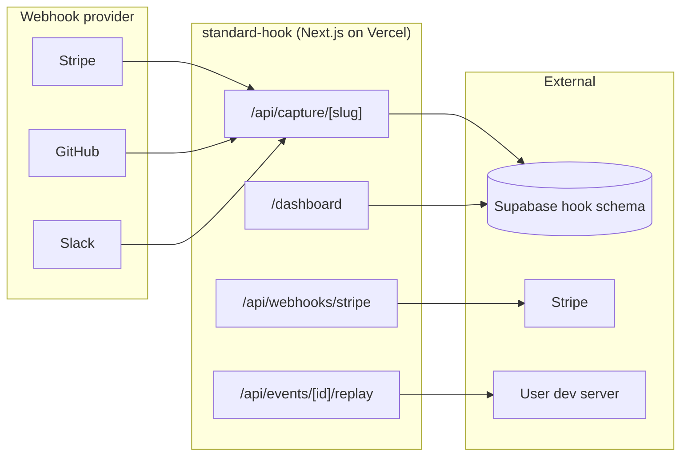
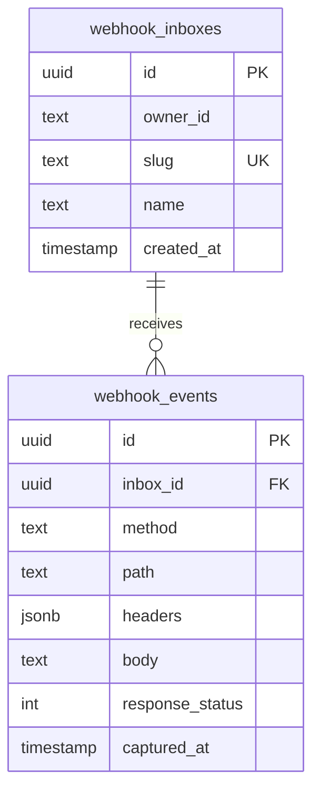

# Standard Hook

**Webhook capture + replay inbox** by Market Standard, LLC. Spin up a unique capture URL for Stripe, GitHub, or any service. Inspect headers and payloads in real time, then replay events to your local dev server.

- **Product strategy:** [STRATEGY.md](./STRATEGY.md)
- **Portfolio context:** [../../docs/STRATEGY.md](../../docs/STRATEGY.md)
- **Deployment:** [../../docs/DEPLOYMENT.md](../../docs/DEPLOYMENT.md)

## Purpose

Standard Hook is the **developer-facing webhook debugger** in the Market Standard portfolio:

- **Capture:** every inbox gets a public `/api/capture/{slug}` endpoint that accepts any HTTP method
- **Inspect:** headers, query params, and raw body stored for every inbound request
- **Replay:** resend any captured event to your dev server with one click
- **Distribution:** FloodG8 VSIX "Copy webhook URL" command + dev tooling SEO

## What it does

| Capability | Status |
|------------|--------|
| Marketing one-pager (`/`) | ✅ |
| Supabase auth + middleware | ✅ |
| Create inbox + capture URL | ✅ `/api/capture/[slug]` |
| Event replay | ✅ `/api/events/[id]/replay` |
| Stripe subscription webhooks | ✅ |
| Health check | ✅ `/api/health` |
| Cross-sell to Postmortem (500 events) | ✅ |

## Architecture



### Data model (`hook` schema)



## Project structure

```
apps/standard-hook/
├── src/app/
│   ├── page.tsx                       Marketing landing
│   ├── api/
│   │   ├── capture/[slug]/route.ts    Public webhook intake
│   │   ├── events/[id]/replay/route.ts
│   │   ├── inboxes/route.ts
│   │   ├── billing/{checkout,portal}/route.ts
│   │   ├── webhooks/stripe/route.ts
│   │   └── health/route.ts
│   ├── dashboard/
│   │   ├── page.tsx
│   │   ├── inboxes/{page,[id]/page}.tsx
│   │   └── billing/page.tsx
│   └── auth/callback/route.ts
├── components/
│   ├── create-inbox-form.tsx
│   ├── hook-dashboard-shell.tsx
│   ├── replay-event-button.tsx
│   └── portal-button.tsx
├── lib/{hook-data,owner}.ts
├── STRATEGY.md
└── .env.example
```

## Development

### Local (no Stripe/Slack credentials)

```bash
# From repo root
pnpm dev:local

# Or this app only (gateway must be running)
pnpm --filter standard-hook dev
```

Open http://localhost:3004

### Environment variables

Copy `apps/standard-hook/.env.example` → `.env.local`.

| Variable | Local dev | Production |
|----------|-----------|------------|
| `NEXT_PUBLIC_LOCAL_DEV` | `true` | unset |
| `DB_GATEWAY_URL` | `http://127.0.0.1:4000` | unset |
| `NEXT_PUBLIC_APP_URL` | `http://localhost:3004` | `https://hook.marketstandard.io` |
| `STRIPE_*` | optional | required for billing |
| `DATABASE_URL` | gateway mode only | Supabase connection string |

## Testing

```bash
# Health
curl http://localhost:3004/api/health

# Create inbox via dashboard, then capture an event:
curl -X POST http://localhost:3004/api/capture/{slug} \
  -H "Content-Type: application/json" \
  -d '{"event":"test","data":"hello"}'

# Replay from the dashboard (one click) or:
curl -X POST http://localhost:3004/api/events/{id}/replay \
  -H "Content-Type: application/json" \
  -d '{"target":"http://localhost:3000/webhook"}'
```

| Check | Expected |
|-------|----------|
| `/` loads marketing hero | Dark theme, capture/replay headline |
| `/api/health` | `{ "status": "ok", "product": "standard-hook" }` |
| `pnpm build` | Exit code 0 |

## Related packages

- `@market-standard/auth` — Supabase session
- `@market-standard/db` — `hook.*` Drizzle tables
- `@market-standard/billing` — plan tiers, Stripe webhooks
- `@market-standard/ui` — `MarketingLanding`, `DashboardShell`, `PoweredByBadge`
