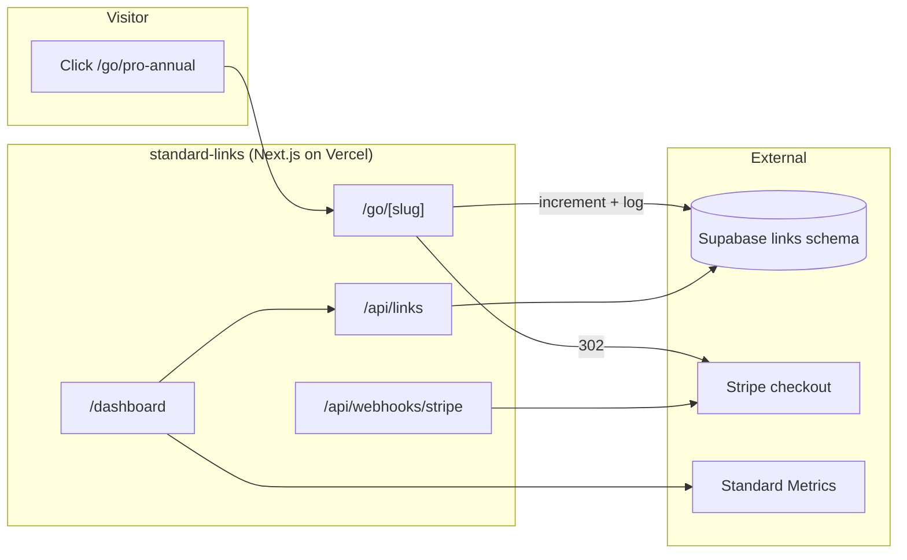
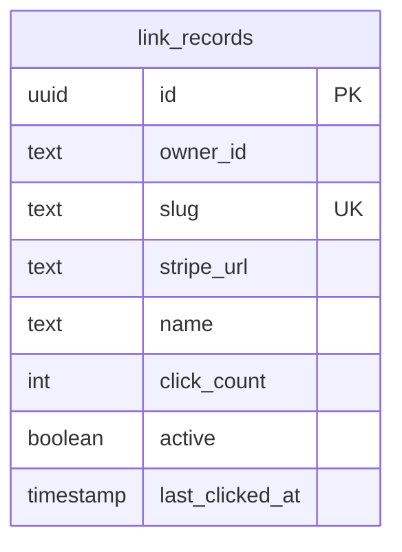

# Standard Links

**Stripe payment link brander + click tracker** by Market Standard, LLC. Paste a Stripe payment link URL, get a branded `/go/<slug>` short link with click tracking, UTM passthrough, and one-click attribution to Standard Metrics.

- **Product strategy:** [STRATEGY.md](./STRATEGY.md)
- **Portfolio context:** [../../docs/STRATEGY.md](../../docs/STRATEGY.md)
- **Deployment:** [../../docs/DEPLOYMENT.md](../../docs/DEPLOYMENT.md)

## Purpose

Standard Links is the **payment link tracker** in the Market Standard portfolio:

- **Shorten:** replace `buy.stripe.com/...` with `yourdomain.com/go/pro-annual`
- **Track:** every redirect increments a click counter + records referrer/UA/UTM metadata
- **Cross-sell:** one click opens Standard Metrics with your connected Stripe account ready to attribute

## What it does

| Capability | Status |
|------------|--------|
| Marketing one-pager (`/`) | ✅ |
| Supabase auth + middleware | ✅ |
| Link CRUD + redirect proxy | ✅ `/go/[slug]` |
| Click tracking | ✅ |
| UTM passthrough | ✅ |
| Pause & resume | ✅ |
| Stripe subscription webhooks | ✅ |
| Health check | ✅ `/api/health` |
| Metrics cross-sell widget | ✅ |

## Architecture



### Data model (`links` schema)



## Project structure

```
apps/standard-links/
├── src/app/
│   ├── page.tsx                       Marketing landing
│   ├── go/[slug]/route.ts             Redirect proxy
│   ├── api/
│   │   ├── links/route.ts
│   │   ├── links/[id]/route.ts
│   │   ├── billing/{checkout,portal}/route.ts
│   │   ├── webhooks/stripe/route.ts
│   │   └── health/route.ts
│   ├── dashboard/
│   │   ├── page.tsx
│   │   ├── links/page.tsx
│   │   └── billing/page.tsx
│   └── auth/callback/route.ts
├── components/
│   ├── links-dashboard-shell.tsx
│   ├── links-manager.tsx
│   ├── metrics-cross-sell-widget.tsx
│   └── portal-button.tsx
├── lib/{links-data,owner}.ts
├── STRATEGY.md
└── .env.example
```

## Development

### Local

```bash
pnpm dev:local
# Or: pnpm --filter standard-links dev
```

Open http://localhost:3007

### Environment variables

| Variable | Local dev | Production |
|----------|-----------|------------|
| `NEXT_PUBLIC_LOCAL_DEV` | `true` | unset |
| `DB_GATEWAY_URL` | `http://127.0.0.1:4000` | unset |
| `NEXT_PUBLIC_APP_URL` | `http://localhost:3007` | `https://links.marketstandard.io` |
| `STRIPE_*` | optional | required for billing |
| `STRIPE_CONNECT_CLIENT_ID` | optional | required for Metrics cross-sell |

## Testing

```bash
curl http://localhost:3007/api/health
# Create a link via dashboard, then:
curl -L http://localhost:3007/go/{slug}
```

| Check | Expected |
|-------|----------|
| `/` loads marketing hero | Dark theme, "Brand and track every Stripe payment link" |
| `/api/health` | `{ "status": "ok", "product": "standard-links" }` |
| `pnpm build` | Exit code 0 |

## Related packages

- `@market-standard/auth` — Supabase session
- `@market-standard/db` — `links.*` Drizzle tables
- `@market-standard/billing` — plan tiers, Stripe webhooks
- `@market-standard/ui` — `MarketingLanding`, `DashboardShell`, `MetricsCrossSellWidget`
