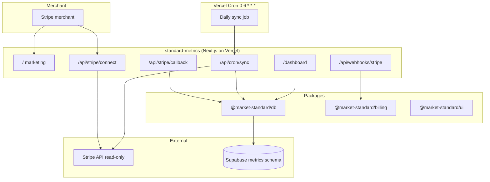
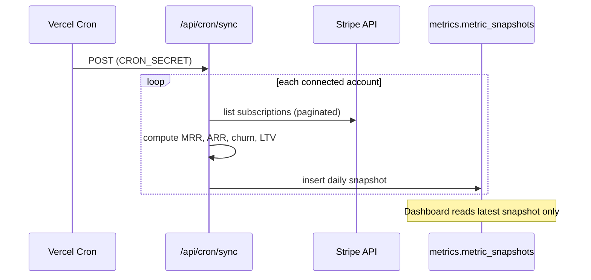
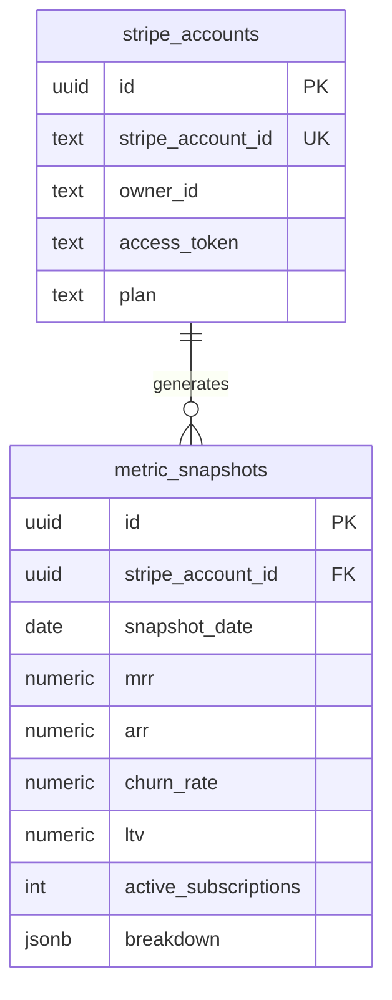

# Standard Metrics

**Stripe subscription analytics dashboard** by Market Standard, LLC. Connect a Stripe account with read-only OAuth and view MRR, ARR, churn, LTV, and active subscriptions. Metrics are pre-computed daily — no live Stripe API calls on dashboard load.

- **Product strategy:** [STRATEGY.md](./STRATEGY.md)
- **Portfolio context:** [../../docs/STRATEGY.md](../../docs/STRATEGY.md)
- **Deployment:** [../../docs/DEPLOYMENT.md](../../docs/DEPLOYMENT.md)

## Purpose

Standard Metrics targets **highest ARPU** in the portfolio ($29–$79/mo):

- **Distribution:** Standalone OAuth web app now; Stripe App Marketplace listing later
- **Value:** Founders need one screen for subscription health without spreadsheet exports
- **Monetization:** Free (30-day history) → Starter ($29, 1 year) → Growth ($79, unlimited + segments)

## What it does

| Capability | Route | Status |
|------------|-------|--------|
| Marketing one-pager | `/` | ✅ |
| Metrics dashboard | `/dashboard` | ✅ |
| Stripe Connect OAuth | `/api/stripe/connect` | ✅ skeleton |
| OAuth callback | `/api/stripe/callback` | ✅ skeleton |
| Daily sync cron | `/api/cron/sync` | ✅ stub |
| Stripe billing webhooks | `/api/webhooks/stripe` | ✅ stub |
| Health check | `/api/health` | ✅ |

## Architecture



### Daily sync flow



### Data model (`metrics` schema)



## Project structure

```
apps/standard-metrics/
├── src/app/
│   ├── page.tsx                  Marketing landing
│   ├── dashboard/page.tsx        MRR / ARR / churn / LTV cards
│   ├── api/
│   │   ├── cron/sync/route.ts    Daily Stripe → DB sync
│   │   ├── stripe/connect/route.ts
│   │   ├── stripe/callback/route.ts
│   │   ├── health/route.ts
│   │   └── webhooks/stripe/route.ts
│   ├── layout.tsx
│   └── globals.css
├── STRATEGY.md
├── .env.example
└── package.json
```

## Development

### Local (demo dashboard, no Stripe)

```bash
pnpm dev:local
# or
pnpm --filter standard-metrics dev   # port 3003
```

| URL | Description |
|-----|-------------|
| http://localhost:3003 | Marketing one-pager |
| http://localhost:3003/dashboard | Seeded metrics (MRR ~$12,400) |
| http://localhost:3003/dashboard?connected=true | Simulates successful Connect |

Seeded account: `acct_demo_local` with 7 days of `metric_snapshots`.

### Environment variables

| Variable | Local | Production |
|----------|-------|------------|
| `NEXT_PUBLIC_LOCAL_DEV` | `true` | unset |
| `DB_GATEWAY_URL` | `http://127.0.0.1:4000` | unset |
| `NEXT_PUBLIC_APP_URL` | `http://localhost:3003` | production URL |
| `STRIPE_CONNECT_CLIENT_ID` | optional | required |
| `STRIPE_SECRET_KEY` | optional | required |
| `CRON_SECRET` | optional | required for `/api/cron/sync` |

### Build

```bash
pnpm --filter standard-metrics build
```

## Testing

No automated tests yet.

```bash
curl http://localhost:3003/api/health
curl http://127.0.0.1:4000/metrics/dashboard
```

| Check | Expected |
|-------|----------|
| `/` marketing | “without the spreadsheet” hero |
| `/dashboard` | MRR $12,400, ARR, churn 3.2%, LTV, 142 subs |
| `revalidate = 60` on dashboard | ISR refresh every 60s |
| Local banner | “Showing seeded PGlite metrics” |

### Stripe Connect testing (staging)

1. Enable Connect on Stripe account ([DEPLOYMENT.md](../../docs/DEPLOYMENT.md))
2. Set redirect URI to `https://<domain>/api/stripe/callback`
3. Click **Connect with Stripe** on production home page
4. Verify `stripe_accounts` row and first cron snapshot

### Cron testing

```bash
curl -X POST https://<preview>/api/cron/sync \
  -H "Authorization: Bearer $CRON_SECRET"
```

## Performance

- **Pre-computed aggregates** — dashboard never calls Stripe on page load
- **ISR** — `revalidate = 60` on dashboard
- **Pagination** — cron uses Stripe `limit=100` with auto-pagination
- **Rate limits** — exponential backoff in cron (when implemented)

## Stripe App Marketplace note

A Connect-enabled Stripe account **cannot** publish Stripe Apps. Launch standalone OAuth first; use a separate Stripe account for future Marketplace listing only.

## Related packages

- `@market-standard/db` — `metrics.*` schema, gateway `/metrics/dashboard`
- `@market-standard/billing` — subscription tiers for history limits
- `@market-standard/ui` — dashboard metric cards, marketing landing
