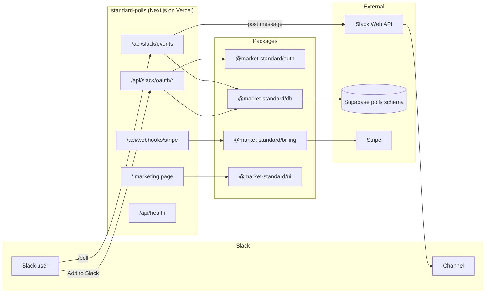
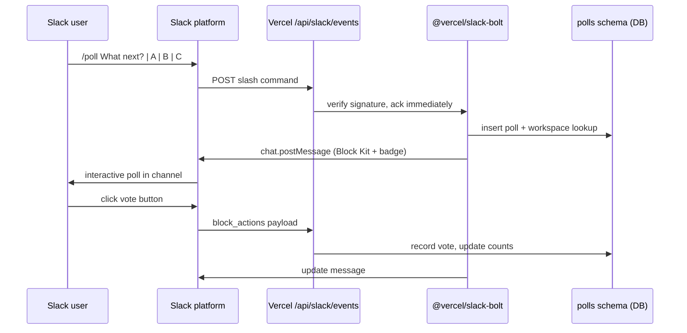
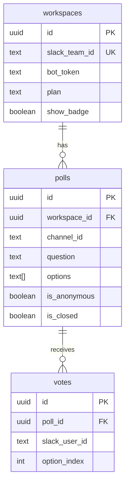

# Standard Polls

**Slack poll and survey bot** by Market Standard, LLC. Create interactive polls in any channel with `/poll Question? | Option A | Option B`. Every poll posts a Block Kit message with a powered-by footer that spreads the brand to the whole team.

- **Product strategy:** [STRATEGY.md](./STRATEGY.md)
- **Portfolio context:** [../../docs/STRATEGY.md](../../docs/STRATEGY.md)
- **Deployment:** [../../docs/DEPLOYMENT.md](../../docs/DEPLOYMENT.md)

## Purpose

Standard Polls is the **fastest path to revenue** in the Market Standard portfolio:

- **Distribution:** Slack App Directory SEO + viral footer on every poll
- **Exposure:** Entire channel sees each poll; Slack Connect shares across workspaces
- **Monetization:** Free tier (10 polls/month, required badge) → Starter ($19) → Growth ($49)

## What it does

| Capability | Status |
|------------|--------|
| Marketing one-pager (`/`) | ✅ |
| Slack OAuth install flow | ✅ skeleton |
| `/poll` slash command + vote buttons | ✅ skeleton |
| Mock install for local dev | ✅ `/api/dev/mock-install` |
| Stripe subscription webhooks | ✅ stub |
| Health check | ✅ `/api/health` |

## Architecture



### Request flow: slash command



### Data model (`polls` schema)



## Project structure

```
apps/standard-polls/
├── src/app/
│   ├── page.tsx                    Marketing landing (MarketingLanding)
│   ├── layout.tsx
│   ├── globals.css
│   └── api/
│       ├── health/route.ts
│       ├── dev/mock-install/route.ts
│       ├── slack/
│       │   ├── events/route.ts     Bolt receiver (lazy init)
│       │   └── oauth/
│       │       ├── install/route.ts
│       │       └── callback/route.ts
│       └── webhooks/stripe/route.ts
├── STRATEGY.md
├── .env.example
└── package.json
```

## Development

### Local (no Slack credentials)

```bash
# From repo root
pnpm dev:local

# Or this app only (gateway must be running)
pnpm --filter standard-polls dev
```

Open http://localhost:3001

- **Marketing page** — FloodG8-styled one-pager
- **Mock Add to Slack** — `GET /api/dev/mock-install` seeds a demo workspace
- **Live stats** — home page reads `/polls/stats` from DB gateway

### Environment variables

Copy `apps/standard-polls/.env.example` → `.env.local`.

| Variable | Local dev | Production |
|----------|-----------|------------|
| `NEXT_PUBLIC_LOCAL_DEV` | `true` | unset |
| `DB_GATEWAY_URL` | `http://127.0.0.1:4000` | unset |
| `NEXT_PUBLIC_APP_URL` | `http://localhost:3001` | `https://polls.marketstandard.io` |
| `SLACK_*` | optional | required |
| `STRIPE_*` | optional | required for billing |
| `DATABASE_URL` | gateway mode only | Supabase connection string |

### Build

```bash
pnpm --filter standard-polls build
pnpm --filter standard-polls dev    # port 3001
```

## Testing

No automated tests in this app yet. Manual verification:

```bash
# Health (local gateway mode reports pglite-gateway)
curl http://localhost:3001/api/health

# Mock install (local only)
curl -L http://localhost:3001/api/dev/mock-install

# Re-seed DB then refresh home page stats
pnpm db:setup
```

| Check | Expected |
|-------|----------|
| `/` loads marketing hero | Dark theme, “brand moment” headline |
| Home DB hint | “1 workspace, 1 poll” after seed |
| `/api/health` | `{ "status": "ok", "product": "standard-polls" }` |
| `pnpm build` | Exit code 0 |

### Slack integration testing (staging)

1. Create Slack app per [DEPLOYMENT.md](../../docs/DEPLOYMENT.md#4-slack-app-setup-standard-polls)
2. Point Request URL to deployed `/api/slack/events`
3. Install to a test workspace
4. Run `/poll` in a channel and verify vote buttons

## Performance notes

- **Ack-first:** Bolt handler acknowledges Slack within 3s; heavy work uses `waitUntil` (Vercel Fluid Compute)
- **Event-driven only** — no polling
- **Plan cache:** workspace plan can be cached per request to avoid extra DB reads

## Related packages

- `@market-standard/auth` — Slack OAuth URL + token exchange
- `@market-standard/db` — `polls.*` Drizzle tables
- `@market-standard/billing` — plan tiers, Stripe webhooks
- `@market-standard/ui` — `MarketingLanding`, `LocalDevBanner`, `PoweredByBadge`
