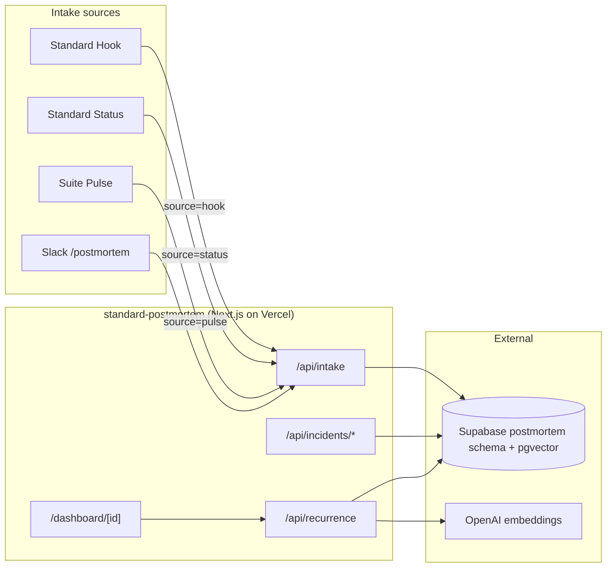
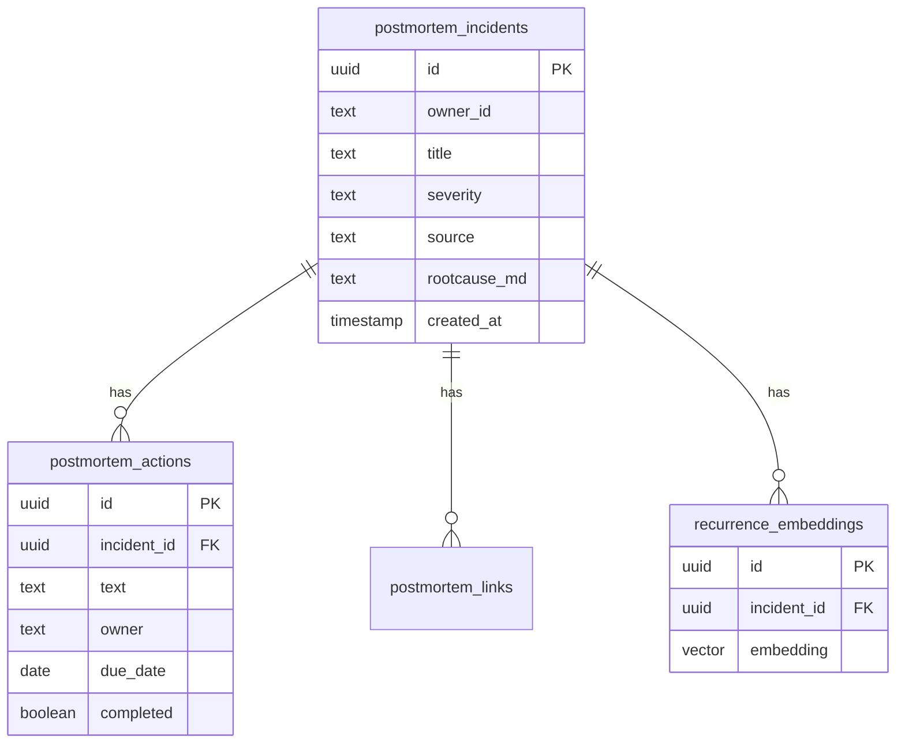

# Standard Postmortem

**Blameless incident postmortem tool with recurrence detection** by Market Standard, LLC. Classic template (Summary, Timeline, Root Cause, What went well / didn't / got lucky), action items with due dates, and `pgvector` embeddings on root-cause text that surface when a new incident looks like an old one. Intake from Standard Hook, Standard Status, Suite Pulse, and Slack.

- **Product strategy:** [STRATEGY.md](./STRATEGY.md)
- **Portfolio context:** [../../docs/STRATEGY.md](../../docs/STRATEGY.md)
- **Deployment:** [../../docs/DEPLOYMENT.md](../../docs/DEPLOYMENT.md)

## Purpose

Standard Postmortem is the **incident retrospective tool** in the Market Standard portfolio:

- **Blameless template:** Summary, Timeline, Root Cause, What went well, What didn't, Where we got lucky
- **Action items:** concrete, owned, dated follow-ups with completion tracking
- **Recurrence detection:** root-cause text embedded via `text-embedding-3-small`; `pgvector` cosine similarity surfaces similar past incidents
- **Intake:** failed webhook (Standard Hook), failed pipeline/deploy (Standard Status), blocker keyword (Suite Pulse), Slack slash command
- **Cross-links:** link a postmortem to the Standard Status incident that triggered it, or the Standard Hook event that surfaced it

## What it does

| Capability | Status |
|------------|--------|
| Marketing one-pager (`/`) | ✅ |
| Supabase auth + middleware | ✅ |
| Incident CRUD + blameless template | ✅ `/api/incidents/*` |
| Action items with due dates | ✅ `/api/incidents/[id]/actions` |
| Cross-links to Status + Hook | ✅ `/api/incidents/[id]/links` |
| Recurrence detection (pgvector) | ✅ `/api/recurrence` |
| Intake webhook (Hook/Status/Pulse) | ✅ `/api/intake` |
| Stripe subscription webhooks | ✅ |
| Health check | ✅ `/api/health` |

## Architecture



### Data model (`postmortem` schema)



## Project structure

```
apps/standard-postmortem/
├── src/app/
│   ├── page.tsx                       Marketing landing
│   ├── api/
│   │   ├── intake/route.ts
│   │   ├── incidents/route.ts
│   │   ├── incidents/[id]/
│   │   │   ├── route.ts
│   │   │   ├── actions/route.ts
│   │   │   └── links/route.ts
│   │   ├── actions/[actionId]/route.ts
│   │   ├── links/[linkId]/route.ts
│   │   ├── recurrence/route.ts
│   │   ├── billing/{checkout,portal}/route.ts
│   │   ├── webhooks/stripe/route.ts
│   │   └── health/route.ts
│   ├── dashboard/
│   │   ├── page.tsx
│   │   ├── new/page.tsx
│   │   ├── [id]/page.tsx
│   │   ├── recurrence/page.tsx
│   │   └── billing/page.tsx
│   └── auth/callback/route.ts
├── components/
│   ├── create-incident-form.tsx
│   ├── incidents-list.tsx
│   ├── postmortem-editor.tsx
│   └── postmortem-dashboard-shell.tsx
├── lib/{postmortem-data,owner}.ts
├── STRATEGY.md
└── .env.example
```

## Development

### Local

```bash
pnpm dev:local
# Or: pnpm --filter standard-postmortem dev
```

Open http://localhost:3011

### Environment variables

| Variable | Local dev | Production |
|----------|-----------|------------|
| `NEXT_PUBLIC_LOCAL_DEV` | `true` | unset |
| `DB_GATEWAY_URL` | `http://127.0.0.1:4000` | unset |
| `NEXT_PUBLIC_APP_URL` | `http://localhost:3011` | `https://postmortem.marketstandard.io` |
| `OPENAI_API_KEY` | optional | required for embeddings |
| `POSTMORTEM_INTAKE_SECRET` | optional | required for intake auth |
| `STRIPE_*` | optional | required for billing |

## Testing

```bash
curl http://localhost:3011/api/health

# Post an intake event from Standard Hook:
curl -X POST http://localhost:3011/api/intake \
  -H "Content-Type: application/json" \
  -d '{"source":"hook","event_id":"abc","inbox_slug":"stripe","title":"Stripe webhook 500","severity":"SEV2"}'
```

| Check | Expected |
|-------|----------|
| `/` loads marketing hero | Dark theme, "Blameless postmortems that catch recurrence" |
| `/dashboard/recurrence` | Recurrence graph renders |
| `/api/health` | `{ "status": "ok", "product": "standard-postmortem" }` |
| `pnpm build` | Exit code 0 |

## Related packages

- `@market-standard/auth` — Supabase session
- `@market-standard/db` — `postmortem.*` Drizzle tables + `pgvector`
- `@market-standard/billing` — plan tiers, Stripe webhooks
- `@market-standard/ui` — `MarketingLanding`, `DashboardShell`
