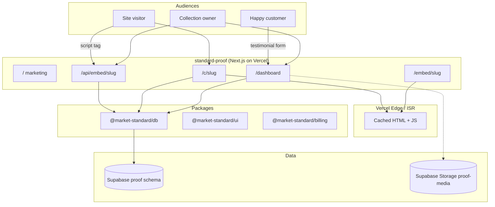
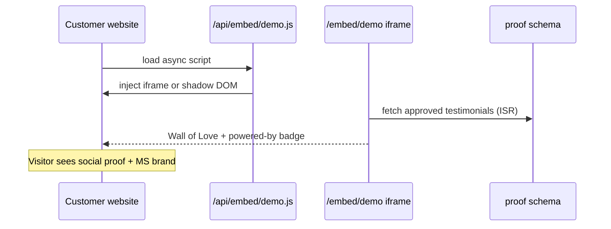
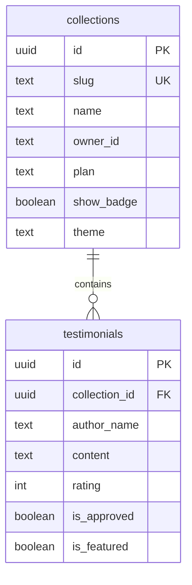

# Standard Proof

**Testimonial Wall of Love** by Market Standard, LLC. Collect customer quotes, approve them in a dashboard, and embed a social-proof widget on any website. Every embed and public page carries a powered-by badge — the broadest viral exposure in the portfolio.

- **Product strategy:** [STRATEGY.md](./STRATEGY.md)
- **Portfolio context:** [../../docs/STRATEGY.md](../../docs/STRATEGY.md)
- **Deployment:** [../../docs/DEPLOYMENT.md](../../docs/DEPLOYMENT.md)

## Purpose

Standard Proof turns customer love into a **living marketing asset**:

- **Distribution:** Embed badge on customer sites + SEO on public `/c/{slug}` pages
- **Exposure:** Every site visitor sees social proof and the Market Standard badge
- **Monetization:** Free (1 collection, 10 testimonials, required badge) → paid badge removal

## What it does

| Capability | Route | Status |
|------------|-------|--------|
| Marketing one-pager | `/` | ✅ |
| Owner dashboard | `/dashboard` | ✅ |
| Public Wall of Love | `/c/[slug]` | ✅ ISR 60s |
| Embed iframe page | `/embed/[slug]` | ✅ |
| Embed JS API | `/api/embed/[slug]` | ✅ |
| Stripe webhooks | `/api/webhooks/stripe` | ✅ stub |
| Health check | `/api/health` | ✅ |

## Architecture



### Embed delivery flow



### Data model (`proof` schema)



## Project structure

```
apps/standard-proof/
├── src/app/
│   ├── page.tsx                 Marketing landing
│   ├── dashboard/page.tsx       Collections + embed snippet
│   ├── c/[slug]/page.tsx        Public Wall of Love
│   ├── embed/[slug]/route.ts    Iframe HTML
│   ├── api/
│   │   ├── embed/[slug]/route.ts
│   │   ├── health/route.ts
│   │   └── webhooks/stripe/route.ts
│   ├── layout.tsx
│   └── globals.css
├── STRATEGY.md
├── .env.example
└── package.json
```

## Development

### Local

```bash
# From repo root (recommended)
pnpm dev:local

# This app only
pnpm --filter standard-proof dev   # port 3002
```

| URL | Description |
|-----|-------------|
| http://localhost:3002 | Marketing one-pager |
| http://localhost:3002/dashboard | Collections list + embed code |
| http://localhost:3002/c/demo | Seeded Wall of Love (3 quotes) |
| http://localhost:3002/api/embed/demo.js | Embed script (when implemented) |

Local mode uses `fetchGateway()` → `http://127.0.0.1:4000/proof/*` when `NEXT_PUBLIC_LOCAL_DEV=true`.

### Embed snippet (local)

```html
<script src="http://localhost:3002/api/embed/demo.js" async></script>
<div data-proof-collection="demo"></div>
```

### Environment variables

| Variable | Local | Production |
|----------|-------|------------|
| `NEXT_PUBLIC_LOCAL_DEV` | `true` | unset |
| `DB_GATEWAY_URL` | `http://127.0.0.1:4000` | unset |
| `NEXT_PUBLIC_APP_URL` | `http://localhost:3002` | production URL |
| `DATABASE_URL` | optional in gateway mode | Supabase pooler URL |
| `STRIPE_*` | optional | required |

### Build

```bash
pnpm --filter standard-proof build
```

## Testing

No automated tests yet. Manual checklist:

```bash
curl http://localhost:3002/api/health
curl http://127.0.0.1:4000/proof/collections/demo   # gateway direct
```

| Check | Expected |
|-------|----------|
| `/` marketing page | “on every page” hero, collection stats |
| `/c/demo` | Alex Chen, Jordan Lee, Sam Rivera quotes |
| `/dashboard` | “Demo Wall of Love” collection + embed `<pre>` |
| Badge on public page | Powered by Market Standard footer |
| `revalidate = 60` on `/c/[slug]` | Page regenerates at most every 60s |

### Embed testing on a real site

1. Deploy to Vercel preview
2. Paste embed snippet into Webflow/Framer custom code block
3. Confirm widget loads and badge is visible
4. Track first-party `embed_view` in `shared.kpi_events` (when wired)

## Performance

- **ISR:** public `/c/[slug]` — `revalidate = 60`
- **CDN headers:** embed routes should use `s-maxage=3600, stale-while-revalidate=86400` in production
- **No WebSockets** — dashboard polls on refresh only
- **Supabase Storage** for avatars (off critical embed path)

## Related packages

- `@market-standard/db` — `proof.*` schema, gateway client
- `@market-standard/ui` — dashboard cards, marketing landing, `PoweredByBadge`
- `@market-standard/billing` — tier limits (collections, testimonials, badge)
