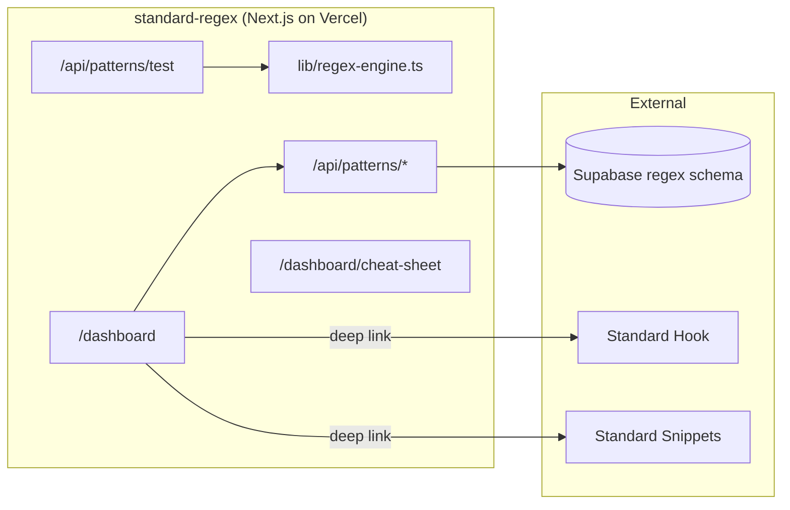
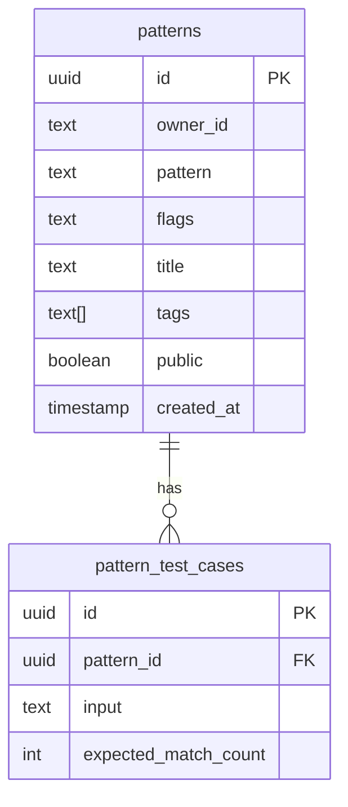

# Standard Regex

**Regex pattern builder + debugger with an explanation engine** by Market Standard, LLC. Live match highlighting with capture groups, test cases with expected-match assertions, a cheat sheet, a public pattern library with fork, and deep-links into Standard Hook (save as webhook body filter) and Standard Snippets (save as snippet).

- **Product strategy:** [STRATEGY.md](./STRATEGY.md)
- **Portfolio context:** [../../docs/STRATEGY.md](../../docs/STRATEGY.md)
- **Deployment:** [../../docs/DEPLOYMENT.md](../../docs/DEPLOYMENT.md)

## Purpose

Standard Regex is the **regex builder + explainer** in the Market Standard portfolio:

- **Test:** live match highlighting with capture groups expanded inline
- **Explain:** every token (anchors, classes, quantifiers, groups, lookarounds) gets a human-readable explanation tree
- **Assert:** attach test cases with expected match counts; runner reports pass/fail per case
- **Library:** mark patterns public to share + fork; tags power search
- **Cheat sheet:** anchored reference for every supported construct
- **Cross-sell:** deep-link into Standard Hook (save as webhook body filter) and Standard Snippets (save as snippet)

## What it does

| Capability | Status |
|------------|--------|
| Marketing one-pager (`/`) | ✅ |
| Supabase auth + middleware | ✅ |
| Pattern CRUD + library | ✅ `/api/patterns/*` |
| Live match + capture groups | ✅ `/api/patterns/test` |
| Explanation engine | ✅ `lib/regex-engine.ts` |
| Test cases with assertions | ✅ |
| Public library + fork | ✅ |
| Cheat sheet | ✅ `/dashboard/cheat-sheet` |
| Stripe subscription webhooks | ✅ |
| Health check | ✅ `/api/health` |
| Cross-sell to Hook + Snippets | ✅ deep links |

## Architecture



### Data model (`regex` schema)



## Project structure

```
apps/standard-regex/
├── src/app/
│   ├── page.tsx                       Marketing landing
│   ├── api/
│   │   ├── patterns/route.ts
│   │   ├── patterns/test/route.ts
│   │   ├── patterns/[id]/route.ts
│   │   ├── billing/{checkout,portal}/route.ts
│   │   ├── webhooks/stripe/route.ts
│   │   └── health/route.ts
│   ├── dashboard/
│   │   ├── page.tsx
│   │   ├── new/page.tsx
│   │   ├── [id]/page.tsx
│   │   ├── cheat-sheet/page.tsx
│   │   └── billing/page.tsx
│   └── auth/callback/route.ts
├── components/
│   ├── patterns-list.tsx
│   ├── regex-editor.tsx
│   └── regex-dashboard-shell.tsx
├── lib/{regex-data,regex-engine,owner}.ts
├── STRATEGY.md
└── .env.example
```

## Development

### Local

```bash
pnpm dev:local
# Or: pnpm --filter standard-regex dev
```

Open http://localhost:3010

### Environment variables

| Variable | Local dev | Production |
|----------|-----------|------------|
| `NEXT_PUBLIC_LOCAL_DEV` | `true` | unset |
| `DB_GATEWAY_URL` | `http://127.0.0.1:4000` | unset |
| `NEXT_PUBLIC_APP_URL` | `http://localhost:3010` | `https://regex.marketstandard.io` |
| `STRIPE_*` | optional | required for billing |

## Testing

```bash
curl http://localhost:3010/api/health
```

| Check | Expected |
|-------|----------|
| `/` loads marketing hero | Dark theme, "Build, test, and explain regex patterns" |
| `/dashboard/cheat-sheet` | Anchored reference renders |
| `/api/health` | `{ "status": "ok", "product": "standard-regex" }` |
| `pnpm build` | Exit code 0 |

## Related packages

- `@market-standard/auth` — Supabase session
- `@market-standard/db` — `regex.*` Drizzle tables
- `@market-standard/billing` — plan tiers, Stripe webhooks
- `@market-standard/ui` — `MarketingLanding`, `DashboardShell`
