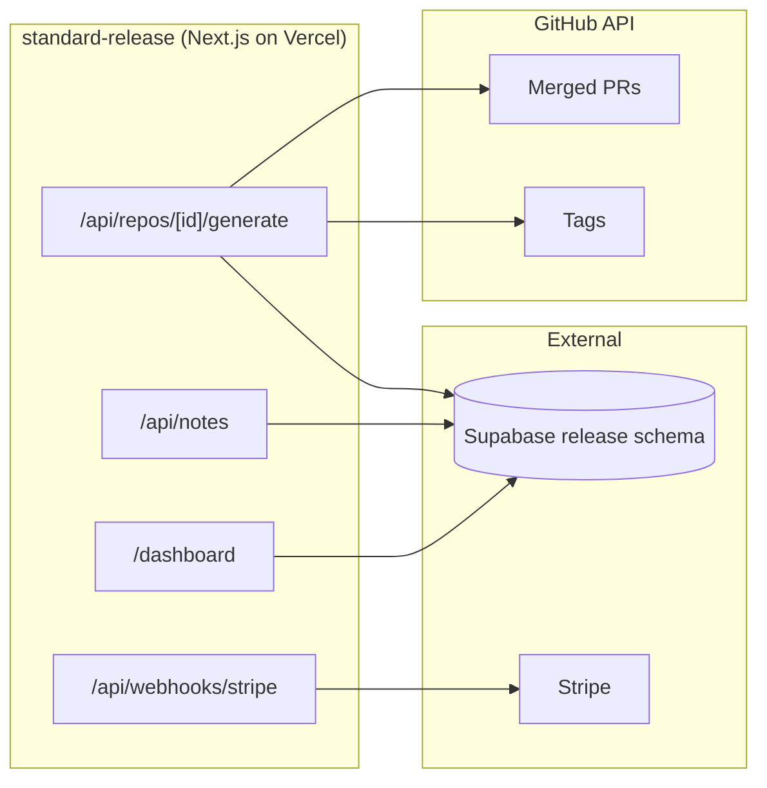
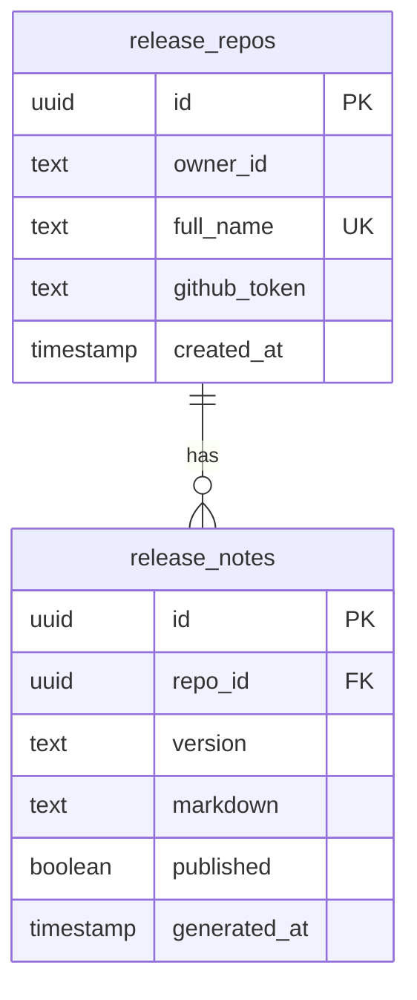

# Standard Release

**GitHub release notes generator** by Market Standard, LLC. Connect a repo, generate markdown release notes from merged pull requests since your last tag, edit in the dashboard, and publish when ready.

- **Product strategy:** [STRATEGY.md](./STRATEGY.md)
- **Portfolio context:** [../../docs/STRATEGY.md](../../docs/STRATEGY.md)
- **Deployment:** [../../docs/DEPLOYMENT.md](../../docs/DEPLOYMENT.md)

## Purpose

Standard Release is the **changelog automation** tool in the Market Standard portfolio:

- **Connect:** add any public or private GitHub repo with `owner/name`
- **Generate:** pulls merged PRs since your latest git tag using `GITHUB_TOKEN`
- **Edit:** markdown editor in the dashboard
- **Publish:** save drafts and mark notes published when they ship

## What it does

| Capability | Status |
|------------|--------|
| Marketing one-pager (`/`) | ✅ |
| Supabase auth + middleware | ✅ |
| GitHub repo connect | ✅ |
| Generate notes from merged PRs | ✅ |
| Markdown editor | ✅ |
| Stripe subscription webhooks | ✅ |
| Health check | ✅ `/api/health` |

## Architecture



### Data model (`release` schema)



## Project structure

```
apps/standard-release/
├── src/app/
│   ├── page.tsx                       Marketing landing
│   ├── api/
│   │   ├── repos/route.ts
│   │   ├── notes/route.ts
│   │   ├── billing/{checkout,portal}/route.ts
│   │   ├── webhooks/stripe/route.ts
│   │   └── health/route.ts
│   ├── dashboard/
│   │   ├── page.tsx
│   │   ├── repos/page.tsx
│   │   ├── notes/[id]/page.tsx
│   │   └── billing/page.tsx
│   └── auth/callback/route.ts
├── lib/{release-data,owner}.ts
├── STRATEGY.md
└── .env.example
```

## Development

### Local (no GitHub token)

```bash
pnpm dev:local
# Or: pnpm --filter standard-release dev
```

Open http://localhost:3005

### Environment variables

| Variable | Local dev | Production |
|----------|-----------|------------|
| `NEXT_PUBLIC_LOCAL_DEV` | `true` | unset |
| `DB_GATEWAY_URL` | `http://127.0.0.1:4000` | unset |
| `NEXT_PUBLIC_APP_URL` | `http://localhost:3005` | `https://release.marketstandard.io` |
| `GITHUB_TOKEN` | optional | required for generation |
| `STRIPE_*` | optional | required for billing |

## Testing

```bash
curl http://localhost:3005/api/health
```

| Check | Expected |
|-------|----------|
| `/` loads marketing hero | Dark theme, "Ship notes from merged PRs" |
| `/api/health` | `{ "status": "ok", "product": "standard-release" }` |
| `pnpm build` | Exit code 0 |

## Related packages

- `@market-standard/auth` — Supabase session
- `@market-standard/db` — `release.*` Drizzle tables
- `@market-standard/billing` — plan tiers, Stripe webhooks
- `@market-standard/ui` — `MarketingLanding`, `DashboardShell`
