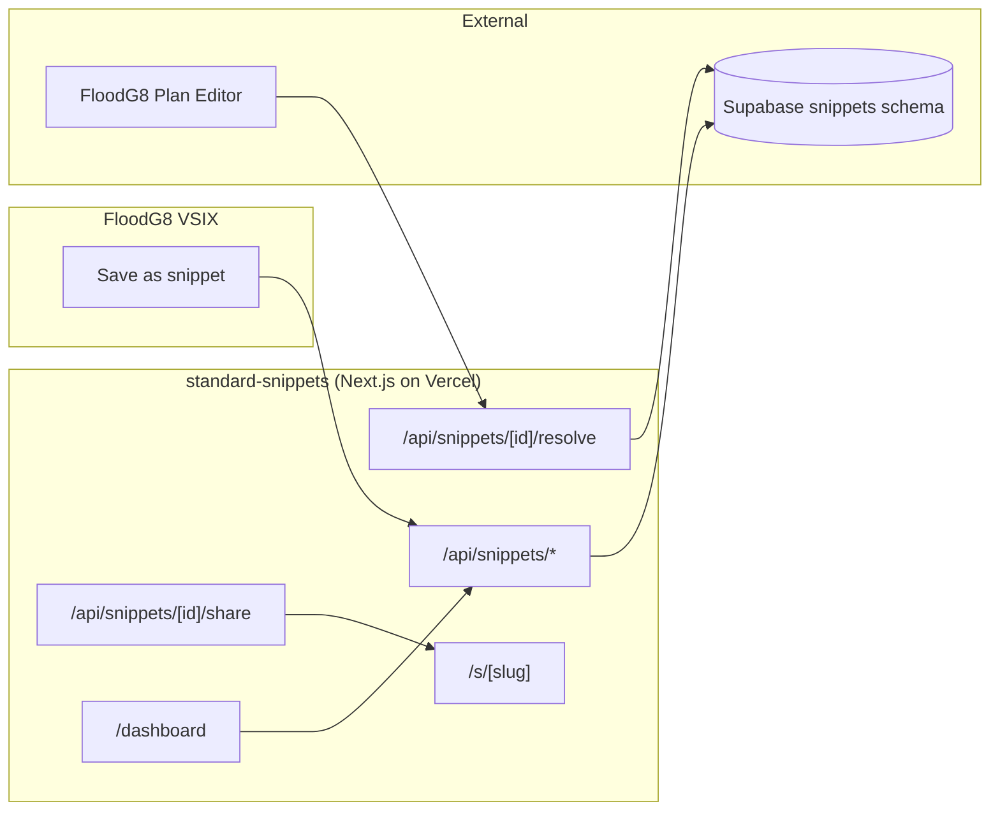
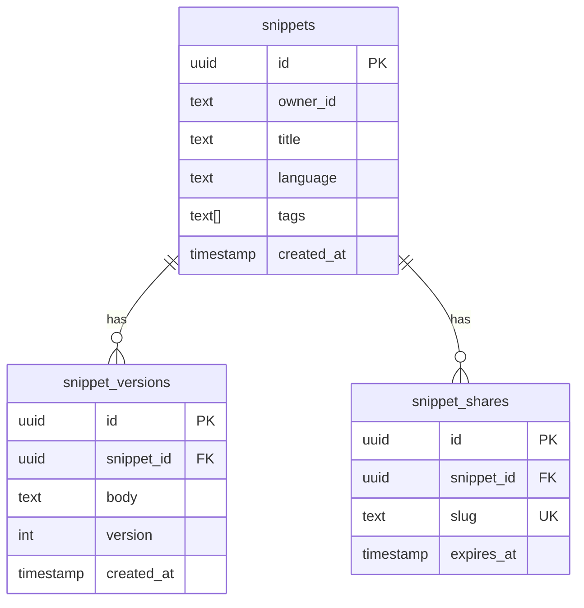

# Standard Snippets

**Code snippet manager for the AI-agent era** by Market Standard, LLC. Save from VS Code selection, tag + search, auto-version every edit, share via signed URL, and insert into FloodG8 Plan Editor with `[[snippet:abc]]` references that always resolve to the latest version.

- **Product strategy:** [STRATEGY.md](./STRATEGY.md)
- **Portfolio context:** [../../docs/STRATEGY.md](../../docs/STRATEGY.md)
- **Deployment:** [../../docs/DEPLOYMENT.md](../../docs/DEPLOYMENT.md)

## Purpose

Standard Snippets is the **code snippet manager** in the Market Standard portfolio:

- **Save:** VSIX "Save as snippet" command from selection (language auto-detected)
- **Version:** every edit creates a new version row; restore any prior version
- **Tag + search:** tag snippets (`#typescript`, `#utility`) and filter the dashboard
- **Share:** mint a `/s/<slug>` URL to share publicly without auth (optional expiry)
- **Reference:** `[[snippet:abc123]]` in FloodG8 Plan Editor resolves to the latest version body

## What it does

| Capability | Status |
|------------|--------|
| Marketing one-pager (`/`) | ✅ |
| Supabase auth + middleware | ✅ |
| Snippet CRUD + auto-versioning | ✅ `/api/snippets/*` |
| Tag + filter | ✅ |
| Signed share URLs | ✅ `/api/snippets/[id]/share` + `/s/[slug]` |
| `[[snippet:]]` resolve endpoint | ✅ `/api/snippets/[id]/resolve` |
| JSON export | ✅ `/api/export/json` |
| Stripe subscription webhooks | ✅ |
| Health check | ✅ `/api/health` |

## Architecture



### Data model (`snippets` schema)



## Project structure

```
apps/standard-snippets/
├── src/app/
│   ├── page.tsx                       Marketing landing
│   ├── s/[slug]/page.tsx              Public share view
│   ├── api/
│   │   ├── snippets/route.ts
│   │   ├── snippets/[id]/
│   │   │   ├── route.ts
│   │   │   └── share/route.ts
│   │   ├── shared/[slug]/route.ts
│   │   ├── export/json/route.ts
│   │   ├── billing/{checkout,portal}/route.ts
│   │   ├── webhooks/stripe/route.ts
│   │   └── health/route.ts
│   ├── dashboard/
│   │   ├── page.tsx
│   │   ├── new/page.tsx
│   │   ├── [id]/page.tsx
│   │   └── billing/page.tsx
│   └── auth/callback/route.ts
├── components/
│   ├── create-snippet-form.tsx
│   ├── snippet-editor.tsx
│   └── snippets-dashboard-shell.tsx
├── lib/{snippets-data,owner}.ts
├── STRATEGY.md
└── .env.example
```

## Development

### Local

```bash
pnpm dev:local
# Or: pnpm --filter standard-snippets dev
```

Open http://localhost:3008

### Environment variables

| Variable | Local dev | Production |
|----------|-----------|------------|
| `NEXT_PUBLIC_LOCAL_DEV` | `true` | unset |
| `DB_GATEWAY_URL` | `http://127.0.0.1:4000` | unset |
| `NEXT_PUBLIC_APP_URL` | `http://localhost:3008` | `https://snippets.marketstandard.io` |
| `STRIPE_*` | optional | required for billing |

## Testing

```bash
curl http://localhost:3008/api/health
```

| Check | Expected |
|-------|----------|
| `/` loads marketing hero | Dark theme, "Save, tag, version, and share code snippets" |
| `/api/health` | `{ "status": "ok", "product": "standard-snippets" }` |
| `pnpm build` | Exit code 0 |

## FloodG8 Plan Editor reference syntax

Paste `[[snippet:abc123]]` into any FloodG8 plan. The editor fetches `/api/snippets/abc123/resolve` and renders the latest version body inline.

## Related packages

- `@market-standard/auth` — Supabase session
- `@market-standard/db` — `snippets.*` Drizzle tables
- `@market-standard/billing` — plan tiers, Stripe webhooks
- `@market-standard/ui` — `MarketingLanding`, `DashboardShell`
