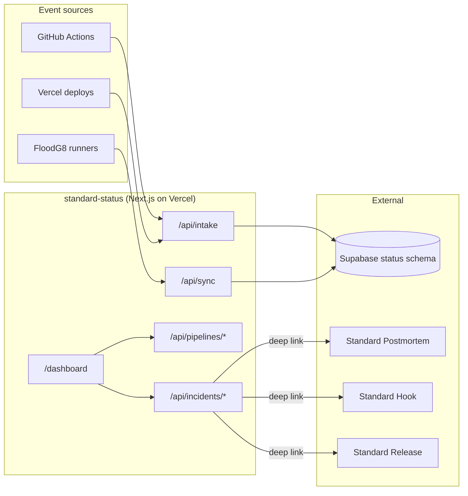
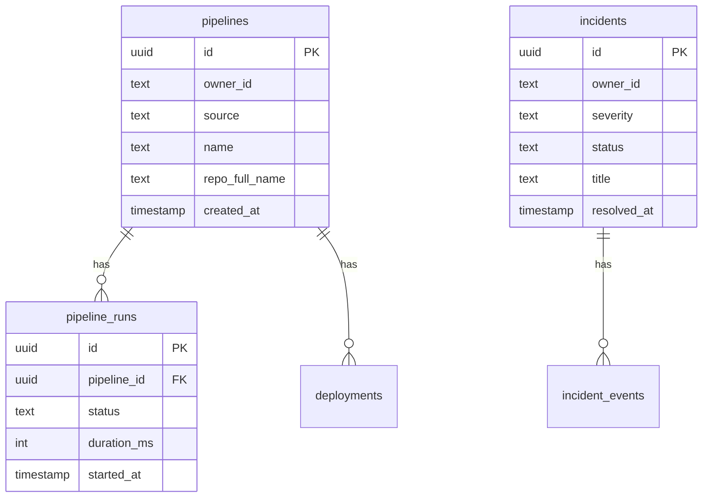

# Standard Status

**Unified build/CI/deploy/incident dashboard** by Market Standard, LLC. One intake webhook accepts events from GitHub Actions, Vercel deployments, and FloodG8 runners. Pipelines show a 30-run sparkline; incidents get severity + one-click resolve; everything cross-links to Standard Postmortem, Standard Hook, and Standard Release.

- **Product strategy:** [STRATEGY.md](./STRATEGY.md)
- **Portfolio context:** [../../docs/STRATEGY.md](../../docs/STRATEGY.md)
- **Deployment:** [../../docs/DEPLOYMENT.md](../../docs/DEPLOYMENT.md)

## Purpose

Standard Status is the **build status dashboard** in the Market Standard portfolio:

- **Unified intake:** `POST /api/intake` with `{ source, event, ownerId, status, ... }` — GitHub `workflow_run`, Vercel deploy, FloodG8 runner
- **30-run sparkline:** each pipeline shows the last 30 runs as a colored bar strip
- **Deploy history:** every deployment logged with environment, SHA, status, URL
- **Incidents:** SEV1–SEV4 with status (investigating → identified → monitoring → resolved), one-click resolve
- **Cross-links:** failed webhook → Standard Hook; shipped fix → Standard Release; retro → Standard Postmortem

## What it does

| Capability | Status |
|------------|--------|
| Marketing one-pager (`/`) | ✅ |
| Supabase auth + middleware | ✅ |
| Pipeline CRUD + 30-run sparkline | ✅ `/api/pipelines/*` |
| Deploy history | ✅ `/api/pipelines/[id]/deployments` |
| Incident feed with severity | ✅ `/api/incidents/*` |
| Unified intake webhook | ✅ `/api/intake` |
| FloodG8 runner sync | ✅ `/api/sync` |
| Stripe subscription webhooks | ✅ |
| Health check | ✅ `/api/health` |

## Architecture



### Data model (`status` schema)



## Project structure

```
apps/standard-status/
├── src/app/
│   ├── page.tsx                       Marketing landing
│   ├── api/
│   │   ├── intake/route.ts            Unified webhook intake
│   │   ├── sync/route.ts              FloodG8 runner sync
│   │   ├── pipelines/route.ts
│   │   ├── pipelines/[id]/
│   │   │   ├── route.ts
│   │   │   └── deployments/route.ts
│   │   ├── incidents/route.ts
│   │   ├── incidents/[id]/route.ts
│   │   ├── billing/{checkout,portal}/route.ts
│   │   ├── webhooks/stripe/route.ts
│   │   └── health/route.ts
│   ├── dashboard/
│   │   ├── page.tsx
│   │   ├── pipelines/[id]/page.tsx
│   │   └── billing/page.tsx
│   └── auth/callback/route.ts
├── components/
│   ├── create-pipeline-form.tsx
│   ├── pipelines-list.tsx
│   ├── deployments-list.tsx
│   ├── incidents-list.tsx
│   └── status-dashboard-shell.tsx
├── lib/{status-data,owner}.ts
├── STRATEGY.md
└── .env.example
```

## Development

### Local

```bash
pnpm dev:local
# Or: pnpm --filter standard-status dev
```

Open http://localhost:3009

### Environment variables

| Variable | Local dev | Production |
|----------|-----------|------------|
| `NEXT_PUBLIC_LOCAL_DEV` | `true` | unset |
| `DB_GATEWAY_URL` | `http://127.0.0.1:4000` | unset |
| `NEXT_PUBLIC_APP_URL` | `http://localhost:3009` | `https://status.marketstandard.io` |
| `STATUS_INTAKE_SECRET` | optional | required for intake auth |
| `GITHUB_TOKEN` | optional | required for GH sync |
| `VERCEL_TOKEN` + `VERCEL_PROJECT_ID` | optional | required for Vercel sync |
| `STRIPE_*` | optional | required for billing |

## Testing

```bash
curl http://localhost:3009/api/health

# Post an intake event:
curl -X POST http://localhost:3009/api/intake \
  -H "Authorization: Bearer $STATUS_INTAKE_SECRET" \
  -H "Content-Type: application/json" \
  -d '{"source":"github","event":"workflow_run","ownerId":"local-dev","status":"success","name":"ci"}'
```

| Check | Expected |
|-------|----------|
| `/` loads marketing hero | Dark theme, "One pane for build, CI, deploys, and incidents" |
| `/api/health` | `{ "status": "ok", "product": "standard-status" }` |
| `pnpm build` | Exit code 0 |

## Related packages

- `@market-standard/auth` — Supabase session
- `@market-standard/db` — `status.*` Drizzle tables
- `@market-standard/billing` — plan tiers, Stripe webhooks
- `@market-standard/ui` — `MarketingLanding`, `DashboardShell`
