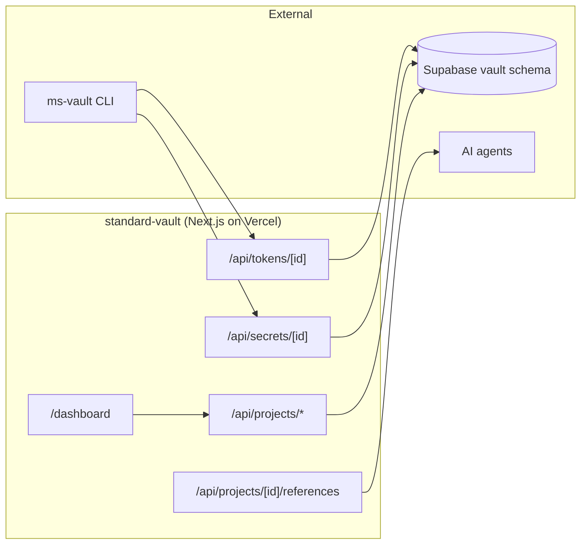
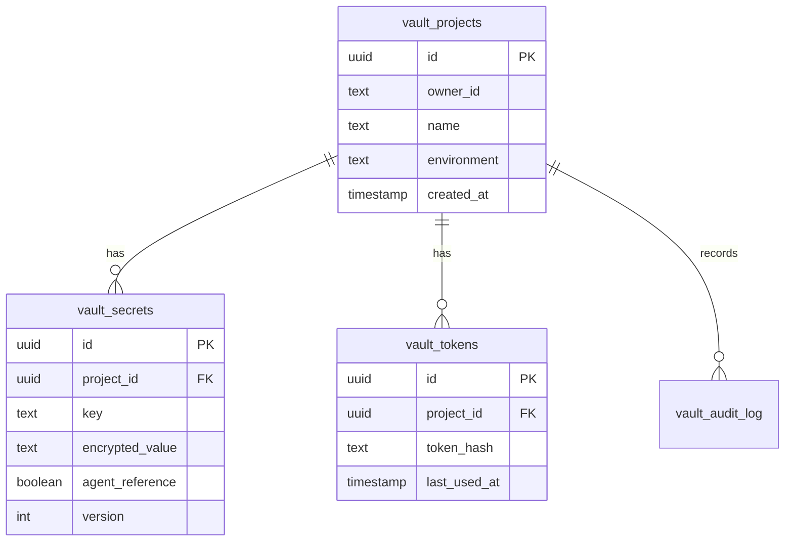

# Standard Vault

**Encrypted secrets manager for the AI-agent era** by Market Standard, LLC. AES-256-GCM encryption at rest, env-injection CLI (`ms-vault run -- <cmd>`), .env/Doppler import, per-project tokens, full audit log, and AI-agent reference mode where agents can discover keys exist without reading values.

- **Product strategy:** [STRATEGY.md](./STRATEGY.md)
- **Portfolio context:** [../../docs/STRATEGY.md](../../docs/STRATEGY.md)
- **Deployment:** [../../docs/DEPLOYMENT.md](../../docs/DEPLOYMENT.md)

## Purpose

Standard Vault is the **secrets manager** in the Market Standard portfolio:

- **Encrypt:** AES-256-GCM with per-tenant key derived from `VAULT_MASTER_KEY`
- **Inject:** `ms-vault run --project X --token Y -- npm start` injects decrypted secrets into child env
- **Import:** paste `.env` or Doppler JSON to bulk-import
- **Reference:** per-secret `agentReference` flag exposes key + version (never value) at `/api/projects/{id}/references`
- **Audit:** every create, rotate, delete, decrypt, and token mint is logged

## What it does

| Capability | Status |
|------------|--------|
| Marketing one-pager (`/`) | ✅ |
| Supabase auth + middleware | ✅ |
| Project + secret CRUD | ✅ `/api/projects/*` |
| AES-256-GCM encryption | ✅ `/api/projects/[id]/decrypt` |
| .env / Doppler import | ✅ `/api/projects/[id]/import` |
| AI-agent reference mode | ✅ `/api/projects/[id]/references` |
| Per-project tokens | ✅ `/api/projects/[id]/tokens` |
| Audit log | ✅ `/api/projects/[id]/audit` |
| Stripe subscription webhooks | ✅ |
| Health check | ✅ `/api/health` |

## Architecture



### Data model (`vault` schema)



## Project structure

```
apps/standard-vault/
├── src/app/
│   ├── page.tsx                       Marketing landing
│   ├── api/
│   │   ├── projects/route.ts
│   │   ├── projects/[id]/
│   │   │   ├── route.ts
│   │   │   ├── audit/route.ts
│   │   │   ├── decrypt/route.ts
│   │   │   ├── import/route.ts
│   │   │   ├── references/route.ts
│   │   │   ├── secrets/route.ts
│   │   │   └── tokens/route.ts
│   │   ├── secrets/[id]/route.ts
│   │   ├── tokens/[id]/route.ts
│   │   ├── billing/{checkout,portal}/route.ts
│   │   ├── webhooks/stripe/route.ts
│   │   └── health/route.ts
│   ├── dashboard/
│   │   ├── page.tsx
│   │   ├── projects/{page,[id]/page}.tsx
│   │   └── billing/page.tsx
│   └── auth/callback/route.ts
├── components/
│   ├── create-project-form.tsx
│   ├── project-detail-manager.tsx
│   └── vault-dashboard-shell.tsx
├── lib/{vault-data,owner}.ts
├── STRATEGY.md
└── .env.example
```

## Development

### Local

```bash
pnpm dev:local
# Or: pnpm --filter standard-vault dev
```

Open http://localhost:3006

### Environment variables

| Variable | Local dev | Production |
|----------|-----------|------------|
| `NEXT_PUBLIC_LOCAL_DEV` | `true` | unset |
| `DB_GATEWAY_URL` | `http://127.0.0.1:4000` | unset |
| `NEXT_PUBLIC_APP_URL` | `http://localhost:3006` | `https://vault.marketstandard.io` |
| `VAULT_MASTER_KEY` | any 32-byte hex | required (KMS-wrapped in prod) |
| `STRIPE_*` | optional | required for billing |

## Testing

```bash
curl http://localhost:3006/api/health
```

| Check | Expected |
|-------|----------|
| `/` loads marketing hero | Dark theme, "Encrypted secrets with AI-agent reference mode" |
| `/api/health` | `{ "status": "ok", "product": "standard-vault" }` |
| `pnpm build` | Exit code 0 |

## Related packages

- `@market-standard/auth` — Supabase session
- `@market-standard/db` — `vault.*` Drizzle tables
- `@market-standard/billing` — plan tiers, Stripe webhooks
- `@market-standard/ui` — `MarketingLanding`, `DashboardShell`
