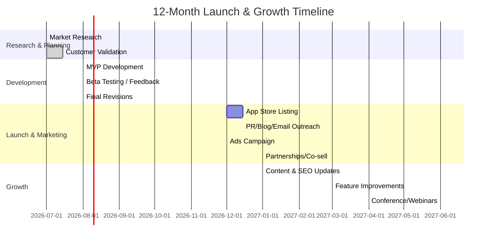
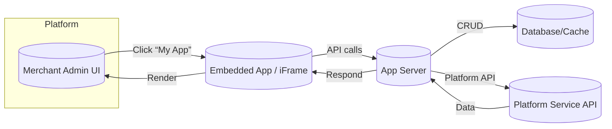
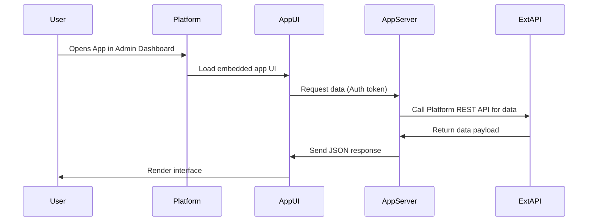

# Executive Summary  
Small, high-performance micro-SaaS apps sold via existing SaaS marketplaces (e.g. Shopify, HubSpot, Atlassian, Slack) can be highly lucrative if well-targeted.  We identify the fastest-growing niches (e-commerce add-ons, CRM/marketing integrations, developer/collaboration tools, etc.) and characterize their buyer personas (from SMB store owners to mid-market sales teams).  We propose a dozen “easy to build” app ideas (focused on one core problem each), with suggested tech stacks, caching/CDN strategies, and dev-time estimates.  We analyze proven pricing and revenue models (tiered subscriptions, usage fees, freemium), giving example price points and unit economics benchmarks (ARPU, LTV).  Case studies of successful marketplace apps (Shopify, Slack, HubSpot) reveal growth tactics (store ads, certification programs, content marketing) and metrics (MRR, installs, ROAS).  We outline go-to-market playbooks (listing SEO, ads, partnerships, reviews) and give an action plan timeline.  Finally, we recommend key KPIs (MRR, churn, CAC, retention, etc.) and include a 12-month financial projection under three scenarios.  We also highlight technical pitfalls and performance best practices (extensive caching, multi-CDN, monitoring) to ensure scalability and reliability.

 *Figure: Example Shopify App Store benchmarks – average app MRR is ~$8.8K (top quartile ~$13.3K).* 

## 1. Top Marketplace Niches & Buyer Personas  
**E‑commerce Platforms (Shopify, BigCommerce, etc.)** – Apps for online stores (inventory, SEO, analytics, marketing).  Buyers are e-commerce store owners and managers (mostly SMBs, <$10M annual revenue).  Many Shopify merchants use 5–6 apps each.  They value cost-effective, self-service tools.  ARR budgets: often modest (tens of USD per month per app), with ARPU ≈ $27–$36.  
**CRM/Marketing (HubSpot, Salesforce, Zoho)** – Integration and productivity apps for marketing/sales teams. Buyers are B2B marketing/sales managers in small-to-mid businesses. HubSpot alone has ~299K customers and 1.5M+ weekly active users.  These teams are well-funded (HubSpot indie app makers report ~$23K MRR on 150 clients).  ARR budgets for valued marketing solutions can range from low five figures (SMBs) to six/seven figures (mid-market).  
**Collaboration/Dev Tools (Slack, MS Teams, GitHub, Atlassian)** – Workflow and productivity add-ons (bots, reports, automations). Buyers are tech teams (dev, IT, project management) across SMBs to enterprises.  Atlassian boasts 8,000+ apps and its marketplace has generated ~$2B+ in sales.  Enterprise buyers are used to paying premium for stable, security-reviewed apps; mid-market buyers seek quick, well-supported solutions.  Typical corporate budgets mean dozens to hundreds of dollars per seat.  
**Payments/Data (Stripe, Google Workspace, etc.)** – Small apps that extend payment, invoicing, or data platforms. Buyers are startups and SMB finance teams.  Pricing is often usage-based. Budgets vary widely but early traction can come from pay-as-you-go models.  

Across these niches, B2B buyers dominate (MS teams, marketing directors, dev leads), with company sizes from single-founder shops to mid-enterprise.  In general:  
- **B2B (SMB)**: Company size 1–50, budgets up to ~$50K/yr, product-led growth.  
- **B2B (Mid-market/Enterprise)**: 50–1000+ employees, willing to spend $10K–$100K+/yr on solutions, often require security/compliance.  
- **B2C/SMB**: e.g. solo e-commerce stores, freelancers – budgets modest ($10s–$100/mo), tools must be very easy to use and cost-effective.  

The Shopify ecosystem is instructive: 85% of merchants use at least one app, averaging ~6 apps each.  This reflects a broad addressable market of SMBs willing to spend on incremental store improvements.  Similarly, 95% of HubSpot users install ≥1 app, indicating strong appetite for integrated tools.

## 2. High-ROI Tool Ideas (≥12 examples)  
Below are 12 vetted micro-SaaS app concepts, each solving a focused problem, with suggested architectures and effort.  All emphasize performance (caching, asynchronous jobs, CDN) and easy monetization (subscription or usage pricing).  Development hours are rough estimates for an MVP.

- **1. Shopify SEO/Image Optimizer:**  Automatically compress product images (to WebP/AVIF), resize lazy-loaded copies, and inject JSON-LD/ALT tags.  *Core*: Bulk image compression (e.g. using Sharp), meta-data editor, SEO audit.  *Stack*: Node.js/Express + React (Shopify Polaris UI) or Next.js; use Shopify’s Admin API for uploads.  Use an on-the-fly CDN (like Cloudflare Images) for serving optimized images.  *Performance*: Pre-cache commonly requested images in CDN; use Redis to cache file transformations; stream processing to avoid UI blocking.  *Effort*: ~150h (image processing has complexities).  *Inspiration*: TinySEO (TinyIMG) achieves ~94% PNG and 54% JPG reduction, plus lazy loading. 

- **2. Shopify Bulk Discount Generator:**  Generate and manage custom discount codes in bulk (e.g. tiered coupons, BOGO rules).  *Core*: Rule-builder UI, scheduled creation of discount codes via Shopify API.  *Stack*: React front-end, Node backend (or serverless functions).  Use Shopify’s Bulk Operation API for efficiency.  *Performance*: Cache frequently used rule templates; paginate API calls; use a queue (e.g. Bull on Redis) to process large batches off the request path.  *Effort*: ~80h.  

- **3. Shopify Abandoned Cart Notifier:**  Trigger automated notifications (email/SMS) or Slack alerts when carts are abandoned.  *Core*: Listen to cart webhooks, match customers, send follow-ups.  *Stack*: Node.js server (Express) handling Shopify webhooks; integrate with SendGrid/Twilio/SMS APIs.  *Performance*: Use durable queues (e.g. AWS SQS) to debounce rapid cart updates; cache API tokens; CDN for static email/SMS templates.  *Effort*: ~100h.  

- **4. HubSpot Data Sync to Sheets/DB:**  Periodically export HubSpot contacts/deals/engagements into Google Sheets or a data warehouse.  *Core*: Scheduled sync service, selective field mapping.  *Stack*: Python or Node (e.g. using AWS Lambda + CloudWatch Cron).  Use HubSpot API SDK. Store state (last-sync timestamps) in DynamoDB or Firestore.  *Performance*: Use incremental API queries (only changed records); cache OAuth tokens; paginate to avoid timeouts.  *Effort*: ~60h.  

- **5. HubSpot SMS/Chat Integration:**  Two-way SMS or chatbot connector for HubSpot (e.g. link Twilio or WhatsApp to HubSpot CRM notes).  *Core*: Capture SMS replies in HubSpot contact timeline; allow sending SMS from HubSpot.  *Stack*: Node/Python server, Twilio API + HubSpot API. Web UI embedded in HubSpot CRM (HubSpot App).  *Performance*: Cache phone-to-contact mappings; queue and retry failed messages; HTTPS webhook endpoints with rate-limit handling.  *Effort*: ~80h.  

- **6. Jira External Share Add-on:**  (Inspired by External Share for Jira) Securely share Jira issues or dashboards with external clients via time-limited links or embed.  *Core*: Generate one-time links, authorization checks, audit logging.  *Stack*: Atlassian Connect (Node.js) or Forge (serverless), Angular/React UI.  *Performance*: Cache Jira REST API calls for issue data; use a CDN for embedded asset (if external viewers).  *Effort*: ~150h (inc. Atlassian compliance).  *Context*: Marketplace research notes demand for custom Jira workflow tools.  

- **7. Jira Reporting Dashboard:**  Custom dashboard app that aggregates sprint, throughput, or cycle-time metrics.  *Core*: Pre-built charts (velocity, cumulative flow) with filters.  *Stack*: Node.js with Express (Atlassian REST API), React (Atlassian UI kit or Polaris).  *Performance*: Pre-compute reports daily and cache results; store recent query results in Redis to serve users quickly; paginate large issues queries.  *Effort*: ~120h.  

- **8. Slack Standup/Survey Bot:**  Automated standup or pulse survey bot that asks daily questions to team members.  *Core*: Scheduling engine (reminders in channels/DMs), collects replies, aggregates in a report.  *Stack*: Slack Bolt framework (Node or Python), serverless scheduler (e.g. AWS Lambda + EventBridge).  *Performance*: Minimal – ephemeral usage.  *Observability*: Log all message events; error monitoring with Sentry.  *Effort*: ~80h.  *Context*: Standuply is an example Slack app that hit $80K/mo. 

- **9. Slack Poll/Vote App:**  Create interactive polls quickly within channels (one-off or recurring).  *Core*: Slash command or app home to define poll, auto-post ephemeral results.  *Stack*: Slack Events API + Interactive Components (Bolt framework).  *Performance*: Very light, but use caching (in-memory or Redis) for active polls; optimize response latency.  *Effort*: ~50h.  

- **10. GitHub Release Notes Generator:**  Tool to compile GitHub PR or commit history into formatted release notes (integrate with GitHub Actions).  *Core*: Extract issues/PRs since last tag, auto-format markdown.  *Stack*: Node.js (with Octokit) or Go app.  Can be offered as a CLI or GitHub App.  *Performance*: Cache GitHub GraphQL queries for heavy repos; rate-limit handling.  *Effort*: ~50h.  

- **11. Stripe Subscription Analytics:**  SaaS dashboard for Stripe merchants to visualize MRR, churn, LTV, and segment by product.  *Core*: Connect Stripe account, import plans/subscriptions, show charts.  *Stack*: Node.js/Express + React or Python (Flask) + any JS charting lib.  Use Stripe API.  *Performance*: Store fetched Stripe data in a DB (PostgreSQL or MongoDB) and cache query results; pre-calc aggregates in background jobs.  *Effort*: ~100h.  

- **12. Stripe Payment Link Manager:**  Web app to manage Stripe Payment Links (list, edit, copy URLs) with stats (clicks, conversions).  *Core*: CRUD UI for payment links, show brief metrics.  *Stack*: Node.js/Express + React.  *Performance*: Cache list of links; lazy-load link details on demand.  *Effort*: ~50h.  

Each idea targets a specific marketplace or platform (e.g. Shopify App, HubSpot App, Atlassian Add-on, Slack App, Stripe Marketplace).  Tech stacks favor **Node.js/Express + React/Next.js** (or Python/Flask) since they’re quick for web UIs and integrations.  Use a **SQL or NoSQL DB** (Postgres, DynamoDB) for state, and **Redis** for caching hot data.  Employ a **CDN (Cloudflare or AWS CloudFront)** for static assets and image files.  Key performance practices include asynchronous background tasks (for webhooks, compressing images, or data sync), paginating API calls, and adhering to platform rate limits. Development effort assumes a small team or solo working full-time; complex apps (like with heavy UI or multi-tenant data flows) are larger estimates (~150h), while simple bots/utilities are smaller (~50–80h).

## 3. Revenue Models & Pricing Strategies  
**SaaS Pricing Patterns:** Popular models include flat-rate, tiered, usage-based, per-seat, and freemium.  Common strategies for marketplace apps:  
- **Tiered Subscription:** e.g. *Basic* at \$19/mo (limited usage/features), *Pro* \$49/mo, *Enterprise* \$99/mo.  Benefits: captures SMBs at lower price, upsells growing accounts.  
- **Usage-Based (Metered):** e.g. \$0.01 per image processed or per batch, after a free allowance.  Good for heavy usage apps (data exports, APIs).  
- **Freemium/Free Trial:** Free tier (e.g. 100 uses or a “Lite” feature set) hooks users; paid upgrade for advanced features.  Eases adoption but ensure conversion via limits or feature-lock.  
- **Per-User Pricing:** For team tools (e.g. “\$10/user/mo, with minimum 5 users”), matching many enterprise buying preferences.  
- **Revenue/Marketplace Share:**  Many SaaS marketplaces take a cut. For example, Shopify (2025) lets app devs keep **100% of the first \$1M in yearly revenue**, then 85% thereafter (Shopify’s docs).  HubSpot famously charges **zero listing or transaction fees**, making it very attractive to indie builders.  (By contrast, AWS/Azure Marketplace often take 20–25%.)  Factor any platform fees into pricing.

**Example Pricing Tiers:** A typical micro-SaaS might use: Free (up to X), Starter (\$19/mo), Growth (\$49/mo), Business (\$99/mo).  For usage-based apps, a common approach is “\$0 free, \$0.02 per API call beyond free 1000 calls”.  

**Unit Economics Benchmarks:**  Aim for healthy LTV:CAC.  Use target ARPU and churn to compute LTV (LTV ≈ ARPU / monthly churn).  For instance, Shopify data shows ARPU ~$27; if monthly churn is ~5%, LTV ~\$540.  If CAC is \$100, that’s a 5.4x LTV:CAC.  HubSpot app vendors see ~$23K MRR (~\$281K ARR) with ~150 customers, implying ARPU ~\$1560 per customer; those products often solve high-value problems.  For small B2B apps, ARPU often ranges \$20–\$100, so target CAC accordingly.  

**Pricing Example:** “App A (Shopify Image Optimizer): Free for 50 images/month, \$20/mo for up to 1000 images, \$50/mo unlimited.  Offering an annual discount (e.g. 15% off) boosts cashflow.  With 200 users at \$20/mo, MRR = \$4K; upsell 10 users to Pro (\$50), add 5 new installs/mo, implies (~\$9K ARR).”  (Detailed unit economics can be modeled as below in projections.)

## 4. Case Studies of Profitable Marketplace Apps  

- **Helium (Shopify Apps):** Helium’s Meteor Mega Menu and Customer Fields apps saw explosive growth through Shopify App Store ads.  By targeting merchants in-store, Helium drove **10,000+ installs** and achieved a **14× ROAS**, resulting in **764% year-over-year revenue growth**.  They emphasize tracking *LTV vs CAC* (knowing “if a customer is worth \$200, you can spend up to \$200 to acquire”).  *Key metrics:* +14x ROAS, +764% revenue, 10k installs over campaign.  They also note the importance of A/B testing ad keywords, geotargets, and plan types for Shopify ads.  

- **Seguno (Shopify Email Marketing App):** Seguno (suite of email, forms, reviews apps) leveraged Shopify’s “Built for Shopify” program.  After certification, Seguno saw **installs increase 14%** and new apps rank on page one of search within days.  They credit *performance* (fast load times: meeting Shopify’s Largest Contentful Paint requirement) and native UI (using Shopify’s Polaris) as reasons for higher merchant trust.  *Key metrics:* +14% installs post-certification, top search ranking in 6 days.  This underscores that meeting platform quality standards directly boosts visibility.  

- **Standuply (Slack App):** Standuply is a Slack-based Agile standup bot.  By April 2019 it had grown to **\$80K/month** in revenue.  Growth tactics included SEO-driven content marketing (blogging on Agile/Slack) and launching novel “catchy” features (polls, voice/video in Slack) that went viral.  They also listed Standuply first for Slack “standup” searches and used Product Hunt for exposure.  *Key metrics:* \$80K MRR; high organic ranking (1st for “standup” on Slack Directory).  

- **HubSpot Indie Apps:** Analysis by Clayton Farr finds the **average successful HubSpot app** (as of 2024) generates **\$23.4K MRR (\$281K ARR)** from ~150 customers.  The HubSpot marketplace itself generates \$70M/month in third-party app revenue (≈\$56K MRR per paid product).  Notably, HubSpot charges **no transaction fees**, and 60% of HubSpot customers use >5 apps.  This illustrates vast opportunity for well-placed, simple apps in B2B marketing/sales spaces.  

- **Atlassian Ecosystem:** Atlassian’s strategy of an open marketplace has paid off: >10 years in, the Atlassian Marketplace has **>$4B in lifetime sales**, with >\$2B in vendor revenue.  Enterprise customers routinely spend as much on add-ons as on Atlassian licenses (~50/50 split).  *Insight:* There is proven buyer readiness to pay for high-quality plugins (rarely free) in this space.  (Top Atlassian apps can have thousands of users and 5-star ratings.)  

These cases show common themes: focus on a niche problem, optimize app performance (a requirement on Shopify), leverage marketplace features (ads, certification, content), and measure tailwinds (platform user growth).  They also highlight key metrics (installs, MRR growth, conversion) and marketing channels (store ads, SEO content).

## 5. Go-To-Market (GTM) Playbook  
**(a) Preparation:**  Before launch, conduct **market research**: survey target users, analyze competitor listings in the marketplace (see Atlassian’s advice to “explore similar apps and user questions”).  Build a clear **buyer persona** and value proposition. Ensure the app meets platform requirements (e.g. Shopify Polaris UI, Atlassian security, Slack verification).  Develop branding: unique name (Shopify suggests “Brand – Feature” format) and polished icon.

**(b) Listing Optimization:**  Your marketplace listing is your primary marketing page.  Write a concise benefit-focused description with bullet points. Include pricing upfront. Use high-contrast screenshots and a short promo video illustrating the app’s value.  Incorporate keywords in the title/description (SEO) but avoid keyword stuffing.  Shopify docs emphasize *performance* in listing: ensure your app “performs well” and doesn’t slow merchant sites.  (Slow apps are penalized; keep Lighthouse score drop <10.)  

**(c) Launch & Marketing:**  
- **Marketplace Ads:**  If available, use in-store ads.  E.g. Shopify App Store ads yielded 14× ROAS for Helium.  Start with a modest budget (\$500/mo recommended) and optimize keywords/geos.  
- **PR & Content:**  Announce the app on developer forums, relevant blogs, and social media.  Write guest posts or case studies about solving the target problem.  Standuply’s success shows “catchy features” and SEO content can drive leads.  Also consider Product Hunt or BetaList for exposure.  
- **Partnerships:**  Collaborate with platform ecosystem partners (e.g. agencies or other app devs).  Joint webinars or co-marketing can be effective.  For example, co-sell or co-market via the platform (HubSpot’s partner program even maps accounts to their sales team).  
- **Reviews & Social Proof:**  Encourage early users to leave positive reviews.  Platforms often sort by rating.  Provide exceptional support to elicit good feedback.  For B2B markets, consider case studies or testimonials once you have users (citing specific growth metrics).  

**Step-by-Step Timeline (Gantt):**  
  

In parallel, continuously monitor performance metrics (see next section) and iterate marketing.  

## 6. Key Metrics & 12-Month Financial Projection  

**Key Performance Indicators (KPIs):**  
- **Revenue:** MRR/ARR, new vs. expansion revenue.  
- **Users:** Total installs, active users (daily/monthly active), trial-to-paid conversion.  
- **ARPU:** Average revenue per active user (benchmark by category; e.g. \$27/mo for Shopify apps).  
- **CAC & LTV:** Cost to acquire a customer vs. lifetime value (ensure LTV >3× CAC).  
- **Churn & Retention:** Monthly churn rate, retention curves. Ideally <5% churn/mo for healthy SaaS.  
- **Usage/Engagement:** Frequency of key actions, API calls, data syncs (drives usage pricing).  
- **Growth:** MRR growth rate (Shopify benchmarks: ~3% MoM avg, top apps ~5.7%).  
- **Product KPIs:** Feature adoption rates, funnel conversion (trial → paid).  
- **Marketing:** Website conversions (visits → trial signups), ad ROI, app store listing views vs. install conversion.  
- **Support:** Number of support tickets, NPS/CSAT feedback.  

**Sample 12-Month Financial Projection:**  Assume a new app with \$30 ARPU and 5% monthly churn (0.95 retention).  Below is illustrative MRR under three scenarios of customer acquisition:

| Month | Conservative MRR | Likely MRR | Optimistic MRR |
|---|---|---|---|
| Jan | \$300 | \$600 | \$1,500 |
| Feb | \$435 | \$870 | \$2,175 |
| Mar | \$563 | \$1,126 | \$2,816 |
| Apr | \$685 | \$1,370 | \$3,425 |
| May | \$801 | \$1,602 | \$4,004 |
| Jun | \$911 | \$1,822 | \$4,554 |
| Jul | \$1,015 | \$2,031 | \$5,076 |
| Aug | \$1,114 | \$2,229 | \$5,572 |
| Sep | \$1,209 | \$2,418 | \$6,044 |
| Oct | \$1,298 | \$2,597 | \$6,492 |
| Nov | \$1,383 | \$2,767 | \$6,917 |
| Dec | \$1,464 | \$2,928 | \$7,321 |

*Assumptions:* Conservative adds ~5 new customers/mo starting at 10 in Jan; Likely adds ~10/mo from 20; Optimistic adds ~25/mo from 50.  (Numbers illustrate the compounding effect of retention.) At \$30 ARPU, Dec MRR ranges \$1.5K–\$7.3K under these scenarios.  Multiply by 12 for ARR.  Unit economics: e.g. if CAC/\$150, with 5% churn, LTV ~\$600 (ARPU÷churn), so payback in ~3–4 months.  

## 7. Risks, Pitfalls & Performance Best Practices  

**Risks & Pitfalls:**  
- **Platform Dependence:** Changes in marketplace rules, APIs or fees (e.g. Atlassian raised revenue share rates) can impact viability.  Mitigation: follow platform news and design modular code.  
- **Competition:** Popular marketplaces can be crowded. Niche focus and differentiated value are key.  (Atlassian warns: research trends and gaps before building.)  
- **Market Demand:** Overestimating demand can waste effort. Validate early with surveys or a landing page.  
- **Technical Debt:** Rushed MVPs that ignore security or scale can bog down later. Use best practices from the start (secure OAuth flows, input validation, logging).  
- **Performance Issues:** Slow response or downtime kills retention. Failure to cache or handle spikes (e.g. many webhook calls) can break your app.  Shopify even mandates apps not noticeably slow merchant stores.  

**Performance Best Practices:**  
- **Caching:** Use Redis or in-memory caches for repeated data (API responses, computed analytics). Cache database query results when possible. Set appropriate TTLs.  
- **CDN:** Serve all static assets (JS/CSS/images) via a CDN. For global reach, a multi-CDN strategy can further improve availability.  (CDN downtime can occur – monitor it.)  Offload heavy content (images, video) to CDN to reduce origin load.  
- **Asynchronous Processing:** Offload long tasks (image crunching, report generation) to background workers/queues. Do not block API responses.  
- **Efficient APIs:** Use GraphQL or bulk REST endpoints to minimize calls. For example, Shopify’s Bulk API or GraphQL reduces round-trips.  
- **Rate Limits:** Respect platform rate limits (implement exponential backoff). Use queued jobs to space out bursty requests.  
- **Observability:** Instrument logging and monitoring early.  Use APM/tracing (New Relic, Datadog) and error tracking (Sentry) to quickly detect latency or errors.  As CDN outages in 2021 showed, you must be ready to detect issues.  
- **Autoscaling:** Deploy on cloud infrastructure that can auto-scale (Kubernetes pods, serverless functions) to handle spikes.  
- **Profiling:** Regularly profile your app (CPU/memory) as user base grows. Optimize slow database queries and avoid n+1 patterns.  

In summary, building for performance pays dividends: faster apps win higher store rankings and happier users. Caching and CDN use will greatly improve response times and reduce hosting costs. Observability is critical: monitor health across the stack (application servers, CDN, third-party APIs) so you can fix bottlenecks or outages before users notice.

## 8. Tool Idea Comparison  

| Tool Idea                     | Complexity (1=easy–5=hard) | Revenue Potential (L/M/H) | Time-to-Market |
|-------------------------------|--------------------------:|--------------------------:|:--------------:|
| Shopify SEO/Image Optimizer   | 4                         | High                      | ~4–6 months    |
| Shopify Bulk Discounts        | 2                         | Medium                    | ~2–3 months    |
| Shopify Cart Abandonment Bot  | 3                         | Medium                    | ~3–4 months    |
| HubSpot Data Syncer           | 2                         | Low–Medium               | ~2–3 months    |
| HubSpot SMS/Chat Connector    | 3                         | Medium                    | ~3–4 months    |
| Jira External Share Add-on    | 4                         | Medium                    | ~4–5 months    |
| Jira Reporting Dashboard      | 3                         | Medium                    | ~3–4 months    |
| Slack Standup/Survey Bot      | 2                         | Low–Medium               | ~1–2 months    |
| Slack Poll App                | 1                         | Low                       | ~1 month       |
| GitHub Release Notes Tool     | 1                         | Low                       | ~1 month       |
| Stripe Subscription Analytics | 3                         | Medium–High              | ~3–4 months    |
| Stripe Payment Link Manager   | 2                         | Medium                    | ~2 months      |

*Notes:* Complexity reflects features and integration difficulty. Revenue potential is qualitative (High=large market or high price). Time-to-market is rough MVP development time (and launch prep). 

These comparisons help prioritize which ideas to pursue based on team capacity and market opportunity. For example, simpler Slack/GitHub tools (low complexity) can go live fastest, while high-value e-commerce/analytics apps (High complexity) may yield bigger returns over time.

*Figure: Example integration flow – an embedded Shopify/Atlassian app (AppUI) within the platform’s admin calls your AppBackend, which in turn fetches/stores data via the platform’s APIs and a database.  Caching (AppDB) offloads frequent requests.*

*Figure: Sequence example – a user opens the app, which triggers a request through your server to the platform’s API, then returns results to the UI.*

**Conclusion:** By focusing on narrowly scoped, performance-optimized tools targeted at proven marketplace niches, developers can tap into existing distribution channels and buyer bases. Prioritize ideas with clear ROI for customers (and doable dev scope). Combine lean development with a strong marketplace launch plan (optimized listing, platform partnerships, paid ads). Track the critical SaaS metrics and tune pricing to ensure unit economics (LTV vs CAC). With attention to performance (CDN, caching, observability) and platform best practices, a small app can grow into a steady revenue stream.  

