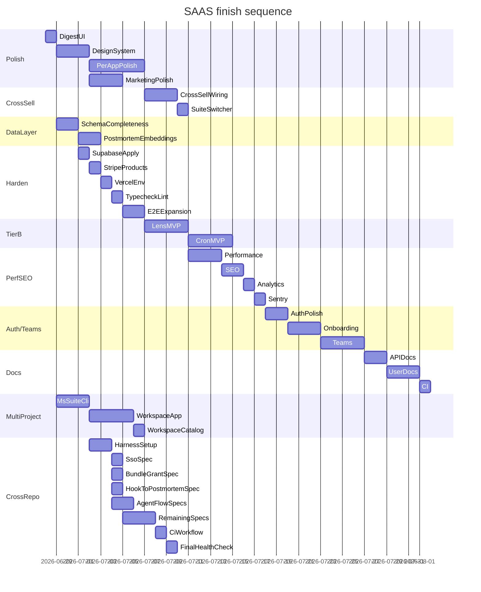

# Market Standard SAAS — Finish Checklist

> **Scope:** Exhaustive list of what is left to finish in `F:\dev\SAAS` so the 11-app portfolio is production-ready, polished, and fully wired into FloodG8 + SyncDevTime + the Market Standard marketing site.
>
> **Audited:** 2026-06-28. All 11 apps scaffolded, full marketing pages, billing/webhook wired, real data layers (97–448 lines each), E2E specs present. The remaining work is **polish, completeness, cross-sell wiring, two unbuilt Tier-B apps, deployment hardening, and documentation**.
>
> **Status legend:** `[ ]` todo · `[~]` partial · `[x]` done
>
> **Companion plans (parallel execution):**
> - `F:\dev\floodg8\docs\SAAS_SUITE_INTEGRATION.md` — FloodG8 cloud + VSIX changes
> - `C:\Users\CJ\OneDrive\repos\MarketStandard\website\marketstandard-app\docs\SAAS_SUITE_DISPLAY.md` — marketing site changes
> - This plan + the two above run in parallel by independent Cursor agents. See §0 for the interconnectivity map + coordination protocol.

---

## 0. Repo interconnectivity map

### Local paths + git remotes
| Repo | Local path | Git remote | Branch |
|------|------------|------------|--------|
| **Market Standard SAAS (this repo)** | `F:\dev\SAAS` | https://github.com/Encryptic1/SAAS.git | `main` |
| FloodG8 cloud + extension | `F:\dev\floodg8` | https://github.com/Encryptic1/floodg8.git | `main` |
| Market Standard Agent Skill CLI | `F:\dev\agent-skill` | **no git remote yet** — needs `git init` + remote add + push | — |
| MarketStandard marketing site | `C:\Users\CJ\OneDrive\repos\MarketStandard\website\marketstandard-app` | https://github.com/marketstandard/marketstandard-app.git | `main` |
| SyncDevTime | (separate repo, not yet located) | — | — |

### Shared infrastructure (single source per concept)
| Resource | Value | Where it lives |
|----------|-------|----------------|
| Supabase project ref | `opodtvblrelmpoaprmpr` | Supabase dashboard; used by all 11 SAAS apps + FloodG8 + SyncDevTime bridge |
| Supabase URL | `https://opodtvblrelmpoaprmpr.supabase.co` | env vars per app (`NEXT_PUBLIC_SUPABASE_URL`, `SUPABASE_URL`) |
| Stripe account | single shared account | Stripe dashboard; every product tagged with `metadata.product` + `metadata.plan_id` |
| Vercel team | per-user | one Vercel project per app, env vars set via `scripts/setup-vercel-envs.ts` |
| Slack workspace | single shared workspace | Slack app config in `apps/standard-polls`; slash commands reused by Postmortem |
| SyncDevTime Supabase | separate project (bridge pattern) | env vars `SYNCDEVTIME_SUPABASE_*` on FloodG8 |

### Source of truth (canonical file per concept — read this before editing)
| Concept | Canonical location | Mirrored / consumed by |
|---------|-------------------|------------------------|
| Stripe `ProductId` union | `F:\dev\SAAS\packages\billing\src\plans.ts` | Stripe MCP creates live products; `F:\dev\SAAS\.env.example` holds `STRIPE_PRICE_*` IDs; FloodG8 bundle grant references them by key |
| Drizzle schema definitions | `F:\dev\SAAS\packages\db\src\schema\*.ts` | `F:\dev\floodg8\supabase\migrations\*.sql` (applied to remote via Supabase MCP); `F:\dev\SAAS\packages\db\src\push-local-schema.ts` (local PGlite) |
| Portfolio bundle map | `F:\dev\floodg8\packages\billing\src\bundle-grant.ts` `PORTFOLIO_BUNDLE_MAP` | `F:\dev\floodg8\packages\shared\src\entitlements.ts` bundle lists on `floodg8-team` + `floodg8-enterprise` |
| Portfolio catalog (15→17 products) | `F:\dev\floodg8\apps\web\api\portfolio\summary.js` `CATALOG` array | `F:\dev\SAAS\packages\ui\src\marketing\portfolio-urls.ts` env URLs; marketing site fetches via `/api/portfolio/catalog` |
| Agent observability API | `F:\dev\floodg8\apps\web\api\portfolio\agent-{report,cost,costs,health}.js` | `F:\dev\agent-skill` `ms-agent` CLI posts to them |
| Marketing site product list | `marketstandard-app\src\screens\LandingScreen\Solutions.tsx` `solutionsData` array | Sanity CMS `product` documents for authenticated marketplace |
| Suite URLs (prod vs local) | `F:\dev\SAAS\packages\ui\src\marketing\portfolio-urls.ts` (env-driven) | `F:\dev\floodg8\packages\shared\src\suite-urls.ts` (planned mirror) |

### Parallel execution protocol
Each repo's plan can be executed by an independent Cursor agent without blocking the others. **Coordination points** (where parallel work intersects — both agents must agree before merge):

1. **New SAAS schema** → mirror as FloodG8 migration → Supabase MCP applies → both repos must agree on table + column shape. SAAS agent edits `packages/db/src/schema/*.ts`; FloodG8 agent edits `supabase/migrations/*.sql`. Use `ms-suite depsync` (Phase 11) to verify parity.
2. **New Stripe product** → `.env.example` updated in SAAS → FloodG8 `PORTFOLIO_BUNDLE_MAP` + entitlements updated → SAAS app billing webhook verifies metadata. Stripe MCP is the single source for live product IDs.
3. **New SAAS app deployed** → FloodG8 `summary.js` CATALOG entry added → marketing site `Solutions.tsx` entry added → Sanity `product` document created. The SAAS app URL must be live before the other two repos reference it.
4. **Supabase migration applied** → SAAS app code expects the table → FloodG8 Portfolio page queries it. Apply migrations BEFORE merging code that depends on them.
5. **VSIX extension command added** (FloodG8) → SAAS app API endpoint that the command calls must exist + accept the FloodG8 JWT. SAAS agent must verify auth accepts the shared Supabase session.

### Cross-repo commit + push order (when an agent completes its plan)
1. Agent commits + pushes its own repo to `main` first.
2. Agent posts a summary in the shared coordination channel (or PR description) listing which coordination points were touched.
3. After all three repos are pushed, run `ms-suite health` (Phase 11) from `F:\dev\SAAS` to verify cross-repo integration.
4. Run the cross-repo integration test suite (Phase 12) — lives in `F:\dev\SAAS\e2e\cross-repo\` but executes against all three repos + Supabase + Stripe.

---

## 1. Current state at a glance

| App | Port | Marketing | Dashboard | Data layer | API | Billing | E2E | STRATEGY/README |
|-----|------|-----------|-----------|------------|-----|---------|-----|------------------|
| standard-polls | 3001 | full | 7 routes | 123 LOC | 15 routes | wired | yes | both |
| standard-proof | 3002 | full | 6 routes | 113 LOC | 8 routes | wired | yes | both |
| standard-metrics | 3003 | full | 6 routes | 334 LOC | 11 routes | wired + Connect | yes | both |
| standard-hook | 3004 | full | 4 routes | 97 LOC | 7 routes | wired | yes | **none** |
| standard-release | 3005 | full | 5 routes | 98 LOC | 7 routes | wired | yes | **none** |
| standard-vault | 3006 | full | 4 routes | 448 LOC | 14 routes | wired | yes | **none** |
| standard-links | 3007 | full | 4 routes | 195 LOC | 6 routes | wired | yes | **none** |
| standard-snippets | 3008 | full | 4 routes | 200 LOC | 9 routes | wired | yes | **none** |
| standard-status | 3009 | full | 3 routes | 233 LOC | 11 routes | wired | yes | **none** |
| standard-regex | 3010 | full | 5 routes | 122 LOC | 7 routes | wired | yes | **none** |
| standard-postmortem | 3011 | full | 5 routes | 309 LOC | 12 routes | wired | yes | **none** |
| standard-lens | — | — | — | — | — | price only | — | — |
| standard-cron | — | — | — | — | — | price only | — | — |

**Single true UI stub:** `apps/standard-polls/src/app/dashboard/digest/page.tsx` (placeholder `EmptyState` while the cron + lib are already wired).

**Tier-B products reserved but unbuilt:** `standard-lens`, `standard-cron` exist only in `packages/billing/src/plans.ts` + `.env.example` price IDs.

---

## Phase 1 — Close the obvious stubs

### 1.1 Polls Suite Digest config UI
- [ ] Replace `apps/standard-polls/src/app/dashboard/digest/page.tsx` with a real config screen:
  - Frequency selector (daily / weekly / off) bound to `shared.digest_configs.frequency`
  - Slack channel picker (uses `conversations.list` via existing Slack client)
  - Source toggles: `metrics`, `floodg8`, `syncdevtime`, `polls`, `standup` (matches `sources jsonb`)
  - "Send test digest" button → `GET /api/cron/digest?preview=1` (already implemented)
  - Last-sent timestamp + last payload preview (read from `shared.pulse_events` source=`digest`)
- [ ] Add `apps/standard-polls/src/components/digest-config-panel.tsx` (form + table)
- [ ] Add `apps/standard-polls/src/lib/digest-config.ts` for CRUD against `shared.digest_configs`

### 1.2 Missing STRATEGY.md + README.md for 8 apps
Each must follow the format of `apps/standard-polls/STRATEGY.md` (problem, persona, GTM, pricing, FloodG8/SDT synergy, cross-sells) and `apps/standard-polls/README.md` (env vars, dev, deploy, e2e):
- [ ] `apps/standard-hook/{STRATEGY.md,README.md}`
- [ ] `apps/standard-release/{STRATEGY.md,README.md}`
- [ ] `apps/standard-vault/{STRATEGY.md,README.md}`
- [ ] `apps/standard-links/{STRATEGY.md,README.md}`
- [ ] `apps/standard-snippets/{STRATEGY.md,README.md}`
- [ ] `apps/standard-status/{STRATEGY.md,README.md}`
- [ ] `apps/standard-regex/{STRATEGY.md,README.md}`
- [ ] `apps/standard-postmortem/{STRATEGY.md,README.md}`

### 1.3 Tier-B apps — decide build vs defer
- [ ] **standard-lens** — DB query optimizer with EXPLAIN visualization + slow query detection. Either:
  - Build full app on port 3012 (scaffold by copying `standard-regex` pattern), or
  - Document as "Coming soon — join waitlist" landing page only
- [ ] **standard-cron** — cron monitor (Vercel Cron + GitHub Actions + FloodG8 runners). Same decision.
- Recommendation: build minimal MVPs in Phase 6 since the Stripe products + bundle grants already exist.

---

## Phase 2 — UI polish across all 11 apps

The dashboards are functional but visually flat. Make them state-of-the-art. All changes go through `packages/ui` first, then per-app consumption.

### 2.1 Design system upgrades in `packages/ui`
- [ ] Add `packages/ui/src/dashboard/skeleton.tsx` — shimmer skeleton primitives (card, row, chart) for every async-loaded surface
- [ ] Add `packages/ui/src/dashboard/toast.tsx` — toast provider with success/error/info variants; replace inline error divs app-wide
- [ ] Add `packages/ui/src/dashboard/empty-state.tsx` illustration variant — accept `illustration?: ReactNode` for inline SVG art per app
- [ ] Add `packages/ui/src/dashboard/badge.tsx` — severity / status / plan badges (reused by Status, Postmortem, Vault audit, Polls)
- [ ] Add `packages/ui/src/dashboard/sparkline.tsx` — inline 60×16 sparkline for table rows (Status pipeline list, Metrics MRR cells, Vault audit log)
- [ ] Add `packages/ui/src/dashboard/kpi-card.tsx` — KPI card with delta arrow + sparkline + comparison period (replaces ad-hoc StatCard usage on Metrics analytics)
- [ ] Add `packages/ui/src/dashboard/page-header.tsx` — consistent title / subtitle / actions / breadcrumb row
- [ ] Add `packages/ui/src/dashboard/command-palette.tsx` — `⌘K` palette with app switcher + per-app commands (cmdk-based)
- [ ] Add `packages/ui/src/dashboard/sidebar.tsx` — collapsible nav with active route indicator + cross-sell links to sibling apps
- [ ] Add `packages/ui/src/dashboard/keyboard-hint.tsx` — `⌘K` hint chip + shortcut labels on buttons
- [ ] Upgrade `packages/ui/src/dashboard/shell.tsx` to consume Sidebar + CommandPalette + ToastProvider by default
- [ ] Refresh `packages/ui/src/dashboard/dashboard.css` tokens: spacing scale, shadow scale, focus ring, motion tokens (cubic-bezier)
- [ ] Add `packages/ui/src/dashboard/data-table.tsx` column sorting, filtering, pagination, row virtualization (current is static)

### 2.2 Per-app dashboard polish
Apply consistently across all 11 dashboards:
- [ ] Replace `EmptyState` text-only with illustrated variants
- [ ] Add skeleton loaders for every server-loaded page (currently most pages just render after DB query)
- [ ] Add toast notifications for every mutation (create/update/delete) — currently most forms silently succeed
- [ ] Add `PageHeader` to every dashboard route with consistent back/crumbs/actions
- [ ] Mobile-responsive audit: every dashboard must work at 375px width (currently most dashboards assume desktop)
- [ ] Keyboard shortcut for `⌘K` palette on every page
- [ ] Loading button state on every form submit (disabled + spinner)
- [ ] Confirm modal on every destructive action (delete inbox, deactivate link, revoke vault token, delete snippet, delete incident)

### 2.3 App-specific polish
- [ ] **Polls** — poll result visualization: donut chart for single-choice, stacked bar for multi-choice; live vote animation; voter avatar strip
- [ ] **Proof** — testimonial wall grid with masonry + hover video play; collection cover image upload with preview
- [ ] **Metrics** — MRR/ARR/LTV/churn charts with period-over-period comparison overlay; segment breakdown with drill-down; Stripe Connect reconnect banner when token expired
- [ ] **Hook** — event viewer with JSON tree + diff against prior event; replay response inspector; inbox filter chips
- [ ] **Release** — repo connect wizard with branch picker; notes preview with markdown rendered side-by-side; "Insert snippet" picker
- [ ] **Vault** — secrets table with reveal-on-click + copy button + audit log inline; project switcher in sidebar; environment diff view (dev vs prod)
- [ ] **Links** — link card with QR code + copy URL + click sparkline; analytics with referrer breakdown
- [ ] **Snippets** — code editor with syntax highlighting (Shiki or Prism); version diff view; tag chips with autocomplete; share modal with expiry picker
- [ ] **Status** — pipeline list with status pill + last-30-runs sparkline; incident timeline; deploy health grid by environment
- [ ] **Regex** — live regex tester with capture groups highlighted in input; explanation tree (already planned); cheat sheet with copy-to-editor
- [ ] **Postmortem** — blameless template with section completion progress; action item kanban with due dates; recurrence graph view

### 2.4 Marketing page polish (all 11 `src/app/page.tsx`)
- [ ] Add product screenshot / hero animation to each marketing hero (currently text-only with `MarketingLanding` template)
- [ ] Add "Trusted by" logo strip if any reference customers exist
- [ ] Add pricing FAQ section below pricing cards
- [ ] Add comparison table vs nearest competitor (e.g. Vault vs Doppler, Snippets vs MassCode, Status vs BetterStack)
- [ ] Add testimonial carousel (pull from Standard Proof if any are public)
- [ ] Open Graph image per app — `public/og/{app}.png` 1200×630
- [ ] Twitter card per app
- [ ] Schema.org JSON-LD for SoftwareApplication per app

---

## Phase 3 — Cross-sell wiring completeness

Many cross-sells are documented in the plan but not wired in code. Each cross-sell is a deep link + (where applicable) a create-resource call.

### 3.1 Hook → Postmortem
- [ ] On `apps/standard-hook/src/app/dashboard/inboxes/[id]/page.tsx` event detail view, when event `response_status >= 500`, show "Create postmortem" button that deep-links to `https://postmortem.marketstandard.io/dashboard/new?source=hook&event_id={id}&inbox_slug={slug}`
- [ ] On Postmortem intake, accept `source=hook` query params and pre-fill timeline with webhook event metadata (already has `apps/standard-postmortem/src/app/api/intake/route.ts`)

### 3.2 Status → Postmortem, Hook, Release
- [ ] On `apps/standard-status/src/app/dashboard/pipelines/[id]/page.tsx`, failed pipeline → "Create postmortem" deep link
- [ ] Failed deploy → "View release notes" deep link to `https://release.marketstandard.io/dashboard/notes/{repo_id}`
- [ ] Failed pipeline with webhook trigger → "Debug webhook in Standard Hook" deep link

### 3.3 Pulse → Postmortem (FloodG8 side, but UI hook in SAAS Postmortem)
- [ ] Postmortem intake accepts `source=pulse` + `blocker_text` and pre-fills root-cause template

### 3.4 Regex → Hook, Snippets
- [ ] On `apps/standard-regex/src/app/dashboard/[id]/page.tsx`, "Save as Hook filter" button → deep link to `https://hook.marketstandard.io/dashboard/inboxes/{slug}?filter={encoded_pattern}`
- [ ] "Save regex as snippet" button → deep link to `https://snippets.marketstandard.io/dashboard/new?language=regex&body={encoded_pattern}`

### 3.5 Snippets → FloodG8 Plan Editor (FloodG8 side, but reference format in SAAS)
- [ ] Document `[[snippet:{snippet_id}]]` reference syntax in `apps/standard-snippets/README.md`
- [ ] Add `apps/standard-snippets/src/app/api/[id]/resolve/route.ts` that returns latest version body for FloodG8 plan editor to fetch

### 3.6 Vault → all apps
- [ ] Add `apps/standard-vault/src/app/api/projects/[id]/inject/route.ts` that returns masked secret map for AI agent reference mode
- [ ] Document `ms-vault run -- <cmd>` CLI shim in `apps/standard-vault/README.md`
- [ ] Per-app docs: how to wire `STRIPE_SECRET_KEY` etc. via Vault reference instead of env var

### 3.7 Metrics → Links (already wired, polish)
- [ ] Verify `apps/standard-links/src/components/metrics-cross-sell-widget.tsx` is rendered on Metrics dashboard
- [ ] Add revenue-per-link breakdown to the widget

### 3.8 Polls → Standup → Pulse (already wired)
- [ ] Verify standup blocker keywords trigger Pulse event (FloodG8 side)
- [ ] Verify standup digest cron includes closed-polls count

### 3.9 Status → FloodG8 runner relay
- [ ] Verify `apps/standard-status/src/app/api/sync/route.ts` pulls FloodG8 runner status from `https://flood-g8.com/api/runs`
- [ ] Add FloodG8 runner as a "pipeline" type in `status.pipelines`

### 3.10 Universal "Suite switcher"
- [ ] Add `packages/ui/src/marketing/suite-switcher.tsx` — dropdown in dashboard shell that links to all 11 apps + FloodG8 + SyncDevTime
- [ ] Render in every app's `dashboard/layout.tsx`

---

## Phase 4 — Data layer + schema completeness

### 4.1 SAAS-side schema
- [ ] Verify `packages/db/src/schema/links.ts` is in `push-local-schema.ts` (agent report says yes, but FloodG8 migration is missing — see FLOODG8-INTEGRATION.md)
- [ ] Add `packages/db/src/schema/metrics.ts` `quotaSamples` table definition if not present (currently may only be in push-local-schema DDL)
- [ ] Add `packages/db/src/schema/postmortem.ts` `recurrence_embeddings` table for `pgvector` embeddings on `rootcause_md`
- [ ] Add `packages/db/src/schema/standup.ts` `blocker_keywords` table for configurable keyword detection per workspace

### 4.2 Postmortem recurrence detection
- [ ] Add `apps/standard-postmortem/src/app/api/incidents/[id]/embed/route.ts` — calls OpenAI `text-embedding-3-small` on `rootcause_md`, stores in `postmortem.recurrence_embeddings`
- [ ] Update `apps/standard-postmortem/src/app/api/recurrence/route.ts` to query `pgvector` similarity (`1 - (embedding <=> query_embedding)`) with configurable threshold
- [ ] UI: when creating a new incident, async-suggest "This looks like incident #abc — link them?" via debounce query

### 4.3 Status incident intake webhooks
- [ ] Verify `apps/standard-status/src/app/api/intake/route.ts` handles GitHub `workflow_run`, Vercel deploy webhook, FloodG8 runner status (currently 85 LOC — confirm all three sources)

### 4.4 Vault AI reference mode
- [ ] Verify `apps/standard-vault/src/app/api/projects/[id]/references/route.ts` returns `{ vault: "STRIPE_SECRET_KEY" }` placeholders (currently 15 LOC thin)
- [ ] Verify `apps/standard-vault/src/app/api/projects/[id]/tokens/route.ts` mints short-lived reference tokens (38 LOC)

### 4.5 Snippets share slug
- [ ] Verify `apps/standard-snippets/src/app/api/snippets/[id]/share/route.ts` mints signed URL (currently 19 LOC)
- [ ] Verify `apps/standard-snippets/src/app/shared/[slug]/page.tsx` public view (currently 12 LOC thin)

---

## Phase 5 — Deployment hardening

### 5.1 Supabase migration apply (via MCP)
- [ ] Apply all 16 FloodG8 migrations to project `opodtvblrelmpoaprmpr` (see FLOODG8-INTEGRATION.md for missing pieces)
- [ ] Run `get_advisors` post-apply; address `auth_leaked_password_protection` WARN
- [ ] Run `list_tables` and verify all 30+ tables exist with correct RLS policies
- [ ] Enable `pgvector` extension for Postmortem recurrence

### 5.2 Stripe products + prices
- [ ] Verify all 13 products exist in Stripe with `metadata.product` and `metadata.plan_id` matching `packages/billing/src/plans.ts` ProductId union
- [ ] Verify price IDs in `.env.example` (`STRIPE_PRICE_*`) match live Stripe price IDs
- [ ] Add `STRIPE_PRICE_*_GROWTH` for all 11 apps (currently only polls/proof/metrics have growth tier in .env.example)
- [ ] Configure Stripe webhook endpoint per app URL (`https://{app}.marketstandard.io/api/webhooks/stripe`)

### 5.3 Vercel project setup per app
For each of the 11 apps, create Vercel project + set env vars (via `scripts/setup-vercel-envs.ts`):
- [ ] `NEXT_PUBLIC_SUPABASE_URL`, `NEXT_PUBLIC_SUPABASE_ANON_KEY`, `SUPABASE_SERVICE_ROLE_KEY`
- [ ] `STRIPE_SECRET_KEY`, `STRIPE_WEBHOOK_SECRET`, `NEXT_PUBLIC_STRIPE_PUBLISHABLE_KEY`
- [ ] `NEXT_PUBLIC_APP_URL` per project
- [ ] `CRON_SECRET` for polls (digest + standup cron) + metrics (sync + quota cron)
- [ ] `SLACK_BOT_TOKEN`, `SLACK_SIGNING_SECRET`, `SLACK_CLIENT_ID`, `SLACK_CLIENT_SECRET` (polls)
- [ ] `STRIPE_CONNECT_CLIENT_ID` (metrics + links)
- [ ] `GITHUB_TOKEN` (release + status)
- [ ] `OPENAI_API_KEY` (postmortem for embeddings)
- [ ] `VERCEL_TOKEN` + `VERCEL_PROJECT_ID` (status)
- [ ] `MODELS_DEV_API_KEY` (agent-skill pack)
- [ ] Set Vercel Cron entries in each app's `vercel.json` (currently only metrics + polls have one)

### 5.4 Typecheck + lint + tests green
- [ ] `pnpm typecheck` — all 16+ packages green
- [ ] `pnpm lint` — green (Biome)
- [ ] `pnpm test:e2e:local` — all 21 specs pass; target 250+ tests (currently ~155)
- [ ] Add `pnpm test:unit` — set up Vitest for data layer unit tests (currently no unit tests)
- [ ] Add `pnpm test:visual` — set up Playwright visual regression snapshots for each dashboard

### 5.5 E2E spec completeness
- [ ] Verify `e2e/billing.spec.ts` covers Proof + Vault + Snippets checkout (not just one app)
- [ ] Verify `e2e/pulse.spec.ts` covers `POST /api/portfolio/agent-report` (FloodG8 side, but spec lives in SAAS)
- [ ] Verify `e2e/quota.spec.ts` renders gauge cards for Stripe/Slack/GitHub/Supabase
- [ ] Add `e2e/cross-sell.spec.ts` — verify Hook → Postmortem deep link, Status → Postmortem deep link, Regex → Hook deep link
- [ ] Add `e2e/command-palette.spec.ts` — ⌘K palette opens, navigates, searches
- [ ] Add `e2e/mobile.spec.ts` — Playwright mobile viewport for each dashboard

### 5.6 Documentation
- [ ] Update `docs/DEPLOYMENT.md` with full 11-app env var matrix (currently lists 5 apps)
- [ ] Add `docs/ARCHITECTURE.md` — monorepo structure, package boundaries, data flow diagram
- [ ] Add `docs/CROSS_SELL_MAP.md` — visual map of every cross-app deep link
- [ ] Add `docs/ENV_VARS.md` — every env var per app with description + where to get it
- [ ] Add `docs/TESTING.md` — how to run unit / e2e / visual tests
- [ ] Add `docs/CONTRIBUTING.md` — how to add a new Standard app (scaffold checklist)

---

## Phase 6 — Tier-B MVP builds (optional but recommended)

### 6.1 standard-lens (port 3012) — DB query optimizer
- [ ] Scaffold `apps/standard-lens` (copy `apps/standard-regex` pattern)
- [ ] Schema `lens` with tables: `queries` (id, owner_id, sql, plan_json, cost_ms, captured_at), `slow_queries` (id, query_id, threshold_ms, captured_at)
- [ ] Dashboard: `/dashboard` (recent queries), `/dashboard/slow` (slow query feed), `/dashboard/explain` (paste SQL → EXPLAIN visualization), `/dashboard/billing`
- [ ] API: `POST /api/explain` (runs `EXPLAIN ANALYZE` via Supabase service role on customer's own DB), `GET /api/queries`, `GET /api/slow`
- [ ] EXPLAIN visualization: tree view of nodes with rows/loops/cost
- [ ] Slow query detection: configurable threshold, alert via Slack/Pulse
- [ ] Cross-sells: Hook (alert on slow query), Status (query health), Pulse (engineering insights)
- [ ] Stripe product: `standard-lens` (free: 100 queries/day; starter $29/mo: unlimited + slow query alerts; growth $99/mo: teams + query history)
- [ ] Marketing page, billing routes, webhook, e2e spec, STRATEGY.md, README.md

### 6.2 standard-cron (port 3013) — cron monitor
- [ ] Scaffold `apps/standard-cron` (copy `apps/standard-status` pattern)
- [ ] Schema `cron` with tables: `jobs` (id, owner_id, source, name, schedule, last_run_at, last_status, last_duration_ms), `runs` (id, job_id, status, started_at, ended_at, error_message)
- [ ] Dashboard: `/dashboard` (job list with status pills), `/dashboard/[id]` (run history + duration chart), `/dashboard/billing`
- [ ] API: `POST /api/intake/vercel` (Vercel Cron completion webhook), `POST /api/intake/github` (GitHub Actions `workflow_run`), `POST /api/intake/floodg8` (FloodG8 runner status), `GET /api/jobs`, `GET /api/jobs/[id]/runs`
- [ ] Alert: missed cron (expected run not seen within 1.5× schedule window) → Slack + Pulse
- [ ] Cross-sells: Status (failed job → incident), Hook (debug webhook), Pulse (engineering health)
- [ ] Stripe product: `standard-cron` (free: 3 jobs; starter $19/mo: 25 jobs + alerts; growth $49/mo: unlimited + teams)
- [ ] Marketing page, billing routes, webhook, e2e spec, STRATEGY.md, README.md

---

## Phase 7 — Performance + SEO + analytics

### 7.1 Performance
- [ ] Add `bundle-analyzer` to root `package.json` scripts; run per app
- [ ] Audit Next.js bundle size per app; code-split heavy charts (Recharts) and editors
- [ ] Add `next/image` for all marketing images (currently using raw `` in some places)
- [ ] Add `next/font` for Inter + Poppins (currently using `@next/font` or CSS import)
- [ ] Set `Cache-Control` headers on `/api/*` routes where appropriate
- [ ] Add Edge runtime to stateless API routes (health, capture, redirect proxies)
- [ ] Add ISR with revalidate to marketing pages (no real-time data needed)
- [ ] Lighthouse CI in GitHub Actions — min 90 perf / 100 a11y / 100 SEO per app

### 7.2 SEO
- [ ] Per-app `src/app/sitemap.ts` (Next.js 15 native)
- [ ] Per-app `src/app/robots.ts`
- [ ] Per-app `metadata` export with title/description/openGraph/twitter
- [ ] Per-app `public/og.png` 1200×630 (use `@vercel/og` for dynamic)
- [ ] Schema.org `SoftwareApplication` JSON-LD per app
- [ ] Blog placeholder per app (single `[slug]` route) — defer full CMS

### 7.3 Analytics
- [ ] Add Vercel Analytics to each app (`@vercel/analytics`)
- [ ] Add PostHog for product analytics (funnels, retention)
- [ ] Add conversion tracking for checkout → success
- [ ] Add `shared.kpi_events` writes for every key action (signup, checkout, dashboard open, first artifact)

### 7.4 Error monitoring
- [ ] Add Sentry SDK to each app (already in env example as `SENTRY_DSN`)
- [ ] Add Error Boundary component in `packages/ui`
- [ ] Add user feedback widget on error
- [ ] Add source maps upload to Sentry on Vercel build

---

## Phase 8 — Auth + onboarding + teams

### 8.1 Auth flow polish
- [ ] Loading state during Supabase OAuth redirect
- [ ] Expired magic link friendly error page with "resend" CTA
- [ ] Email template branding (Supabase email templates)
- [ ] MFA support via Supabase Auth MFA enroller
- [ ] SSO via `shared.sso_codes` for Enterprise tier (FloodG8-side, but SAAS apps must accept SSO token)

### 8.2 Onboarding
- [ ] First-run tour (react-joyride or similar) per app
- [ ] Empty-state CTAs that link to "Create your first X" with sample data
- [ ] Sample data seeder: `pnpm db:seed` per app
- [ ] Setup wizard for apps that require integration (Metrics: Stripe Connect, Polls: Slack install, Status: GitHub connect, Vault: import .env)

### 8.3 Teams + RBAC
- [ ] `shared.team_members` table (already partial in `polls.workspace_members`)
- [ ] Team management UI per app
- [ ] Role-based access: owner / admin / member / viewer
- [ ] Invitation flow via email + magic link

### 8.4 Notifications
- [ ] In-app notification center component in `packages/ui`
- [ ] `shared.notifications` table (id, user_id, type, payload, read_at)
- [ ] Email notifications via Resend or Postmark
- [ ] Slack DM notifications via existing Slack client (Polls)

---

## Phase 9 — API + SDK + docs

### 9.1 API documentation
- [ ] Add OpenAPI spec per app (use `next-rest` or hand-rolled)
- [ ] Generate Postman collection from OpenAPI
- [ ] Host API docs at `/api/docs` per app (Swagger UI or Stoplight)
- [ ] Add `docs/API.md` per app with curl examples

### 9.2 SDK
- [ ] Generate TypeScript SDK from OpenAPI (`openapi-typescript-codegen`)
- [ ] Publish as `@marketstandard/client-{app}` to npm
- [ ] Use SDK in `ms-agent` CLI + FloodG8 extension

### 9.3 User docs
- [ ] Per-app user guide at `/docs` route (or `docs.marketstandard.io/{app}`)
- [ ] Video walkthroughs (Loom) embedded in user guide
- [ ] Knowledge base with search (Algolia or Pagefind)
- [ ] Changelog per app (Keep-a-changelog format)

---

## Phase 10 — Quality gates + CI

### 10.1 CI pipeline
- [ ] GitHub Actions workflow: `typecheck → lint → test:unit → test:e2e:local → build` on every PR
- [ ] Required status checks before merge to main
- [ ] Vercel preview deployment per PR
- [ ] Lighthouse CI on preview deployment
- [ ] Bundle size check (delta vs main)

### 10.2 Dependency hygiene
- [ ] `pnpm audit` clean
- [ ] Renovate or Dependabot enabled
- [ ] No unused dependencies (use `knip`)
- [ ] Pin all dependencies to exact versions

### 10.3 License compliance
- [ ] Add `LICENSE` per package (MIT)
- [ ] Add `NOTICE.md` for third-party attributions
- [ ] Run `license-checker` in CI

---

## Phase 11 — Multi-project dev tools (quick wins)

These tools solve the immediate pain of developing across 3 repos (SAAS + FloodG8 + agent-skill) + 13 apps + Supabase + Stripe + Vercel + Slack. They are **quick wins** because the CLI is fast to build and the dashboard is a thin Next.js app on top of the same library.

### 11.1 `ms-suite` CLI (in `F:\dev\agent-skill` repo)

Add a second binary `ms-suite` alongside the existing `ms-agent` in the agent-skill repo. Same package, two binaries via `package.json` `bin` field.

**Files to create in `F:\dev\agent-skill`:**

**Pre-flight (git init):** The agent-skill repo currently has no git remote. Before starting Phase 11.1:
- [ ] `cd F:\dev\agent-skill && git init && git add . && git commit -m "init: ms-agent CLI"`
- [ ] Create GitHub repo `https://github.com/Encryptic1/agent-skill.git` (or under `marketstandard` org)
- [ ] `git remote add origin https://github.com/Encryptic1/agent-skill.git && git push -u origin main`
- [ ] Add `.gitignore` (node_modules, dist, .env)
- [ ] Add `LICENSE` (MIT)
- [ ] Add `README.md` (install + usage)
- [ ] Make repo public (it's an open-source companion)

- [ ] `F:\dev\agent-skill\bin\ms-suite.js` — second bin entry
- [ ] `F:\dev\agent-skill\src\suite-cli.ts` — main CLI entry (Commander.js or clipanion)
- [ ] `F:\dev\agent-skill\src\suite-commands\dev.ts` — `ms-suite dev`
- [ ] `F:\dev\agent-skill\src\suite-commands\health.ts` — `ms-suite health`
- [ ] `F:\dev\agent-skill\src\suite-commands\tunnel.ts` — `ms-suite tunnel`
- [ ] `F:\dev\agent-skill\src\suite-commands\depsync.ts` — `ms-suite depsync`
- [ ] `F:\dev\agent-skill\src\suite-commands\ports.ts` — `ms-suite ports`
- [ ] `F:\dev\agent-skill\src\suite-commands\release.ts` — `ms-suite release`
- [ ] `F:\dev\agent-skill\src\suite-commands\test.ts` — `ms-suite test` (runs Phase 12 cross-repo integration tests)
- [ ] `F:\dev\agent-skill\src\lib\suite-config.ts` — reads `~/.ms-suite/config.json` + per-repo `package.json` to build the suite model
- [ ] `F:\dev\agent-skill\src\lib\suite-orchestrator.ts` — process spawning + log capture + health polling
- [ ] Update `F:\dev\agent-skill\package.json` `bin` to `{ "ms-agent": "bin/ms-agent.js", "ms-suite": "bin/ms-suite.js" }`

**Commands:**

| Command | What it does |
|---------|--------------|
| `ms-suite dev` | Spawns all 11 SAAS apps + FloodG8 web + FloodG8 extension dev server + SyncDevTime (if cloned) in parallel with port conflict detection + log prefixing + graceful shutdown on Ctrl-C. Replaces the current `pnpm dev:local` with cross-repo orchestration. |
| `ms-suite dev --filter=polls,metrics,floodg8` | Start only the named subset. |
| `ms-suite dev --health-check` | After spawn, poll each app's `/api/health` until 200 or 30s timeout; print a status table. |
| `ms-suite health` | Suite-wide health check: each app `/api/health`, Supabase `opodtvblrelmpoaprmpr` reachability, Stripe reachable, Vercel project env vars set, Slack reachable, FloodG8 `/api/portfolio/catalog` returns 15+ products, all 13 Stripe products exist with `metadata.product`. Exits non-zero if any critical check fails. |
| `ms-suite health --json` | Same output as JSON for CI integration. |
| `ms-suite tunnel` | Start a Cloudflare Tunnel (or localtunnel) for each app that needs webhook intake (Hook, Status, Postmortem, Vault); print the public URLs; auto-update each app's `NEXT_PUBLIC_APP_URL` for the current session. |
| `ms-suite tunnel --app=hook` | Tunnel only the named app. |
| `ms-suite depsync` | Verify dependency parity: every `ProductId` in `packages/billing/src/plans.ts` has a Stripe product; every Stripe product has a `.env.example` `STRIPE_PRICE_*` entry; every FloodG8 `PORTFOLIO_BUNDLE_MAP` key matches a `ProductId`; every Drizzle schema table has a FloodG8 migration; every CATALOG entry has a `portfolio-urls.ts` URL. Prints a diff. |
| `ms-suite depsync --apply` | Auto-fix safe drift (e.g. add missing `.env.example` entries with placeholder values). |
| `ms-suite ports` | Print the port map: 3001–3011 (existing), 3012–3016 (Tier-B + new tools), 4000 (db gateway), 5173 (FloodG8 Vite), 54322 (PGlite). Detect conflicts with running processes. |
| `ms-suite release --apps=polls,metrics --bump=patch` | Tag + push + Vercel-promote for the named apps in coordinated fashion; writes a changelog entry to `docs/CHANGELOG.md` per app. |
| `ms-suite test --suite=cross-repo` | Run the Phase 12 cross-repo integration test suite. |
| `ms-suite test --suite=e2e --app=polls` | Run a single app's e2e. |

**Suite model** (`~/.ms-suite/config.json`):
```json
{
  "repos": {
    "saas":       { "path": "F:\\dev\\SAAS",       "type": "monorepo", "apps": "apps/standard-*" },
    "floodg8":    { "path": "F:\\dev\\floodg8",    "type": "monorepo", "dev": "pnpm dev:web" },
    "agent-skill":{ "path": "F:\\dev\\agent-skill","type": "package",  "dev": "pnpm dev" },
    "marketstandard": { "path": "C:\\Users\\CJ\\OneDrive\\repos\\MarketStandard\\website\\marketstandard-app", "type": "next", "dev": "yarn dev" }
  },
  "supabase": { "projectRef": "opodtvblrelmpoaprmpr", "url": "https://opodtvblrelmpoaprmpr.supabase.co" },
  "vercel": { "team": "marketstandard" },
  "ports": { "base": 3001, "floodg8": 5173, "gateway": 4000, "pglite": 54322 }
}
```

### 11.2 `standard-workspace` dashboard app (port 3014)

A thin Next.js app that's the visual UI for `ms-suite`. Pairs with the CLI — same library, two surfaces.

**Scaffold by copying `apps/standard-status` pattern (port 3014, product `standard-workspace`).**

- [ ] `apps/standard-workspace/` — new app
- [ ] `packages/db/src/schema/workspace.ts` — new schema with tables:
  - `workspace_sessions` (id, owner_id, command, pid, started_at, ended_at, exit_code, logs jsonb)
  - `workspace_health_checks` (id, owner_id, target, kind, status, latency_ms, error, checked_at)
  - `workspace_tunnels` (id, owner_id, app, local_port, public_url, started_at, stopped_at)
- [ ] Dashboard: `/dashboard` (live status grid of all 13 apps + FloodG8 + SyncDevTime + Supabase + Stripe), `/dashboard/sessions` (active dev sessions with log viewer), `/dashboard/tunnels` (active webhook tunnels), `/dashboard/health` (health check history + charts), `/dashboard/depsync` (parity diff viewer), `/dashboard/billing`
- [ ] API: `POST /api/sessions` (start a `ms-suite dev` session, captures pid + logs), `GET /api/sessions`, `POST /api/sessions/[id]/stop`, `POST /api/health/run` (trigger `ms-suite health`), `POST /api/tunnels` (start tunnel), `GET /api/depsync` (run `ms-suite depsync`)
- [ ] **Real-time logs** via Server-Sent Events or WebSocket (Recharts only renders history; live tail needs SSE)
- [ ] **Cross-sells**: Status (workspace session failures appear as incidents), Snippets (save a `ms-suite dev --filter=...` command as a snippet), Vault (workspace sessions read Vault secrets for local dev), Pulse (workspace session count → engineering activity)
- [ ] Stripe product: `standard-workspace` (free: 1 user, 1 session; starter $9/mo: 5 sessions + tunnels; growth $29/mo: unlimited + team sessions + dep diff)
- [ ] Marketing page, billing routes, webhook, e2e spec, STRATEGY.md, README.md
- [ ] Update `packages/billing/src/plans.ts` ProductId union with `standard-workspace`
- [ ] Update `.env.example` with `STRIPE_PRICE_WORKSPACE_STARTER`
- [ ] Update `e2e/helpers.ts` BASE + `e2e/stack-constants.ts` HEALTH_URLS for port 3014
- [ ] Update `F:\dev\floodg8\apps\web\api\portfolio\summary.js` CATALOG (add `standard-workspace`)
- [ ] Update `F:\dev\floodg8\packages\billing\src\bundle-grant.ts` `PORTFOLIO_BUNDLE_MAP` (add `standard-workspace-starter`)
- [ ] Update `F:\dev\floodg8\packages\shared\src\entitlements.ts` bundle lists
- [ ] Update `marketstandard-app/src/screens/LandingScreen/Solutions.tsx` (add Standard Workspace card)

### 11.3 `standard-tunnel` (port 3015) — optional standalone, or fold into Workspace

Either build as a separate app or fold into `standard-workspace`'s `/dashboard/tunnels` route. Recommendation: **fold into Workspace** for MVP (Phase 11.2 already includes tunnels). If demand grows, split out as `standard-tunnel` on port 3015 with:
- Per-app tunnel lifecycle (start/stop/rotate URL)
- Tunnel history + replay (record webhook payloads for debugging)
- Pair with Hook — tunnels route to Hook inboxes for inspection
- Stripe product: `standard-tunnel` (free: 1 tunnel; starter $9/mo: 5 tunnels + replay; growth $29/mo: unlimited + team)

For now, defer the standalone app. The `ms-suite tunnel` CLI + Workspace's `/dashboard/tunnels` route cover MVP.

### 11.4 Cross-repo benefits
- `ms-suite dev` replaces the manual `pnpm dev:local` + `cd F:\dev\floodg8 && pnpm dev:web` + `cd F:\dev\agent-skill && pnpm dev` juggling
- `ms-suite health` becomes the daily pre-flight check before opening any PR
- `ms-suite depsync` catches drift early (e.g. Stripe product created but `.env.example` not updated — current state today)
- `ms-suite test --suite=cross-repo` is the single command for Phase 12 integration testing
- `standard-workspace` dashboard gives non-CLI users (designers, PMs) visibility into suite health

---

## Phase 12 — Cross-repo integration test suite

The existing `e2e/*.spec.ts` covers per-app flows. This phase adds **cross-repo integration tests** that verify the three repos work together as a unified suite. Lives in `F:\dev\SAAS\e2e\cross-repo\` but executes against all three repos + Supabase + Stripe + Slack + Vercel.

### 12.1 Test harness setup
- [ ] `F:\dev\SAAS\e2e\cross-repo\` — new directory
- [ ] `e2e/cross-repo/fixtures.ts` — shared fixtures: test user, test Slack channel, test Stripe customer, test Supabase rows
- [ ] `e2e/cross-repo/helpers.ts` — cross-repo helpers: `fetchFloodG8Catalog()`, `postAgentReport()`, `pollSupabaseRow()`, `mintSSOCode()`, `deepLink()`
- [ ] `e2e/cross-repo/global-setup.ts` — runs `ms-suite dev --filter=...` to bring up the apps needed for the test run, waits for `/api/health` on each
- [ ] `e2e/cross-repo/global-teardown.ts` — graceful shutdown of spawned apps
- [ ] `playwright.config.ts` — add a second `project` for cross-repo tests with a longer timeout (120s) + a separate `testDir: 'e2e/cross-repo'`
- [ ] `package.json` — add `"test:e2e:cross-repo": "playwright test --config=playwright.cross-repo.config.ts"`

### 12.2 Test scenarios (each is a Playwright spec)

| Spec | Verifies |
|------|----------|
| `e2e/cross-repo/sso.spec.ts` | User signs into FloodG8 → clicks "Open Standard Vault" on Portfolio page → SSO code minted → Vault `/auth/callback?code=...` exchanges → Vault dashboard renders with the user's session. Sign out of FloodG8 → signing out of Vault should also work (best-effort propagation). |
| `e2e/cross-repo/bundle-grant.spec.ts` | User on FloodG8 Team plan → bundle grant fires → `shared.billing_customers` has rows for all 13 Standard products → each SAAS app's billing page shows "Starter (included in FloodG8 Team)" → user can deep-link into each app without re-paying. |
| `e2e/cross-repo/hook-to-postmortem.spec.ts` | Post a failing webhook (500 response) to `hook.marketstandard.io/api/capture/[slug]` → Hook event detail page renders "Create postmortem" button → click → deep-links to `postmortem.marketstandard.io/dashboard/new?source=hook&event_id=...` → Postmortem form pre-fills timeline with webhook event metadata → submit → incident created with source=hook. |
| `e2e/cross-repo/status-to-postmortem.spec.ts` | Mock a failed GitHub Actions `workflow_run` event → POST to `status.marketstandard.io/api/intake/github` → Status incident feed shows the failure → click "Create postmortem" → deep-links to Postmortem → pre-fills. |
| `e2e/cross-repo/regex-to-hook.spec.ts` | Save a regex pattern in `regex.marketstandard.io` → click "Save as Hook filter" → deep-links to `hook.marketstandard.io/dashboard/inboxes/[slug]?filter=...` → Hook inbox filter chips show the regex → next webhook matching the regex is highlighted. |
| `e2e/cross-repo/snippet-to-floodg8.spec.ts` | Save a snippet in `snippets.marketstandard.io` → copy `[[snippet:{id}]]` reference → FloodG8 Plan Editor resolves the reference → editor fetches `snippets.marketstandard.io/api/snippets/[id]/resolve` → latest version body renders inline. |
| `e2e/cross-repo/vault-inject.spec.ts` | Create a secret in `vault.marketstandard.io` → VSIX `Vault: Inject into Terminal` command (simulated via extension test) → terminal receives `export KEY=value` lines → secret value matches what's in Vault. |
| `e2e/cross-repo/agent-cost-flow.spec.ts` | `ms-agent cost` CLI parses a test Claude session.jsonl → POST to `flood-g8.com/api/portfolio/agent-cost` → FloodG8 Portfolio AgentCostWidget renders the new cost → `GET /api/portfolio/agent-costs` returns the entry. |
| `e2e/cross-repo/agent-report-flow.spec.ts` | `ms-agent report "..."` CLI → POST to `flood-g8.com/api/portfolio/agent-report` → FloodG8 Portfolio Suite Pulse feed shows the agent event → AgentHealthPanel updates with the new report. |
| `e2e/cross-repo/standup-blocker.spec.ts` | Standup cron in polls runs → detects blocker keyword in a response → writes `shared.pulse_events` with source=agent → FloodG8 Portfolio Pulse feed shows the blocker → suggests "Create postmortem" deep-link. |
| `e2e/cross-repo/suite-digest.spec.ts` | `POST polls.marketstandard.io/api/cron/digest` with `Authorization: Bearer {CRON_SECRET}` → cron fetches Metrics MRR + FloodG8 runs summary + SyncDevTime hours + closed polls count → composes Slack blocks → in local dev, returns `preview: true` with the composed blocks → assert blocks contain all 4 source values. |
| `e2e/cross-repo/portfolio-catalog.spec.ts` | `GET flood-g8.com/api/portfolio/catalog` returns 17 products (13 Standard + FloodG8 + SyncDevTime + Agent Skill + Standard Workspace) → each has `id, name, tagline, url` → marketing site `/api/v1/suite-catalog` proxies it → marketing site `/standard-suite` renders all 17 cards. |
| `e2e/cross-repo/marketing-site.spec.ts` | `GET marketstandard.app/` → homepage `Solutions` section renders 18+ cards grouped by category → `/standard-suite` route returns 200 → nav has "Standard Suite" tab → footer has Suite link. |
| `e2e/cross-repo/quota-monitor.spec.ts` | `POST metrics.marketstandard.io/api/cron/quota` samples Stripe + Slack + GitHub + Supabase rate limits → `metrics.quota_samples` rows inserted → Metrics `/dashboard/quota` gauge cards render with the new samples. |
| `e2e/cross-repo/postmortem-recurrence.spec.ts` | Create incident A with root-cause text → embedding generated → create incident B with similar root-cause text → recurrence API suggests linking → link created → `/dashboard/recurrence` graph shows the edge. |
| `e2e/cross-repo/workspace-dev.spec.ts` | `ms-suite dev --filter=polls,metrics,floodg8` starts the 3 apps → `standard-workspace` `/dashboard/sessions` shows the active session → logs stream via SSE → `POST /api/sessions/[id]/stop` cleanly shuts down all 3 apps. |
| `e2e/cross-repo/health.spec.ts` | `ms-suite health` exits 0 when all 13 apps + Supabase + Stripe + Vercel + Slack are reachable → exits non-zero when any critical check fails → `--json` output is valid JSON with per-check status. |
| `e2e/cross-repo/depsync.spec.ts` | `ms-suite depsync` exits 0 when all dependencies are in parity → exits non-zero with a diff when e.g. a Stripe product is missing from `.env.example` → `--apply` adds the missing entry. |

### 12.3 CI integration
- [ ] GitHub Actions workflow `cross-repo-tests.yml` runs on every PR to main in any of the 3 repos
- [ ] Workflow steps: checkout all 3 repos → install pnpm → `pnpm db:setup` → `pnpm install` in agent-skill → `ms-suite dev --health-check` → `pnpm test:e2e:cross-repo`
- [ ] Required status check before merge to main in any repo
- [ ] Daily scheduled run (3am UTC) on main branch to catch integration drift

### 12.4 Test data + cleanup
- [ ] Use a dedicated test Supabase user (`ms-test-user@marketstandard.com`) with known JWT
- [ ] Use Stripe test mode (`sk_test_...`) — never production keys in CI
- [ ] Each spec cleans up its own rows in `shared.*`, `polls.*`, `proof.*`, etc. via `afterEach`
- [ ] Global teardown drops the test user + all owned rows
- [ ] Use a dedicated Slack channel `#ms-test` for digest + standup tests

### 12.5 Reporting
- [ ] Playwright HTML report published as GitHub Actions artifact
- [ ] Failed spec posts to `#ms-engineering` Slack channel via existing Slack client
- [ ] Trend dashboard in `standard-workspace` `/dashboard/health` showing pass rate over time

---

## Implementation order



**Critical path:** Phase 1 (stubs + design system) → Phase 2 (polish) → Phase 5 (harden) → Phase 11 (multi-project tools) → Phase 12 (cross-repo tests) → Phase 6 (Tier-B) → Phase 7–10 (scale).

**Parallel agent execution:** Phase 11.1 (`ms-suite` CLI in agent-skill repo) can run in parallel with Phase 1–5 (SAAS-side). Phase 12 test scenarios can be written in parallel with Phase 11.2 (`standard-workspace` app) since they only need the test harness + Phase 11.1 CLI. Phase 12 specs that depend on `standard-workspace` (workspace-dev.spec, health.spec) wait for Phase 11.2.

---

## Definition of done

- [ ] All 11 apps + 2 Tier-B apps + `standard-workspace` have full marketing, dashboard, API, billing, webhook, e2e, STRATEGY, README (14 apps total)
- [ ] No `EmptyState`-only dashboard pages
- [ ] All dashboards pass Lighthouse 90+ perf / 100 a11y / 100 SEO
- [ ] All cross-sell deep links wired and tested in `e2e/cross-sell.spec.ts`
- [ ] Supabase migration applied to `opodtvblrelmpoaprmpr` with `get_advisors` clean
- [ ] All 14 Stripe products + prices created with `metadata.product` + `metadata.plan_id` (11 + lens + cron + workspace)
- [ ] All 14 Vercel projects with env vars set (no deploys without user approval)
- [ ] `pnpm typecheck && pnpm lint && pnpm test:e2e:local` all green; 250+ tests
- [ ] `pnpm test:e2e:cross-repo` all green; 18 cross-repo specs pass
- [ ] `ms-suite health` exits 0 — all 14 apps + Supabase + Stripe + Vercel + Slack reachable
- [ ] `ms-suite depsync` exits 0 — no drift between Stripe products / `.env.example` / bundle map / schemas / migrations / CATALOG / portfolio-urls
- [ ] `docs/DEPLOYMENT.md` has full 14-app env var matrix
- [ ] FloodG8 Portfolio page shows all 17 Standard products (11 + lens + cron + workspace + FloodG8 + SyncDevTime + Agent Skill) as connected/disconnected cards
- [ ] MarketStandard marketing site lists all 18 products on homepage `Solutions` section (17 + standard-workspace) and `/standard-suite` route renders all 18
- [ ] Sanity CMS has 18 `product` documents for the authenticated marketplace
- [ ] Sentry + Vercel Analytics + PostHog integrated on all apps
- [ ] API docs hosted at `/api/docs` per app
- [ ] GitHub Actions `cross-repo-tests.yml` required status check on all 3 repos

---

## Out of scope (this checklist)

- Production deploys without explicit user approval (per `docs/DEPLOYMENT.md`)
- Mobile native apps (suite is web + VSIX + CLI only)
- On-prem / self-hosted Standard Vault (cloud-only; self-host is a future Enterprise tier)
- Full GitHub App installation flow for Standard Release (uses `GITHUB_TOKEN` PAT for MVP; GitHub App later)
- Replacing SyncDevTime's standalone Supabase (bridge pattern stays)
- Shopify / HubSpot / Atlassian marketplace apps (deep-research #1–#7 deferred)
