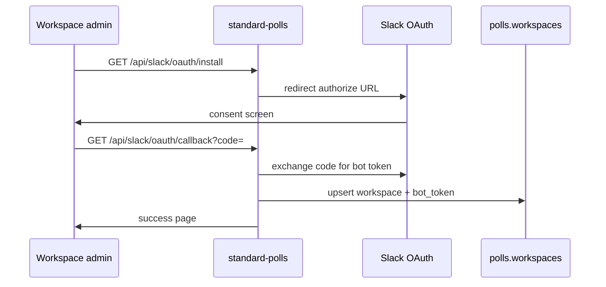

# @market-standard/auth

Shared authentication helpers: **Supabase Auth** for dashboard users and **Slack OAuth** for Standard Polls workspace installation.

## Purpose

- Avoid duplicating OAuth URL construction and token exchange
- Single place for Supabase server/client client factories
- Standard Polls install flow uses Slack; Proof and Metrics use Supabase Auth (dashboard)

## Architecture

```mermaid
flowchart TB
  subgraph standard_polls
    Install[/api/slack/oauth/install]
    Callback[/api/slack/oauth/callback]
  end

  subgraph standard_proof_metrics
    Dash[Dashboard - future auth guard]
  end

  subgraph AuthPkg["@market-standard/auth"]
    Slack[slack.ts]
    Supa[supabase.ts]
  end

  subgraph External
    SlackOAuth[Slack OAuth]
    SupabaseAuth[Supabase Auth]
  end

  Install --> Slack
  Callback --> Slack
  Slack --> SlackOAuth
  Dash --> Supa
  Supa --> SupabaseAuth
```

### Slack OAuth sequence (Polls)



## Exports

```typescript
import {
  createSupabaseServerClient,
  createSupabaseBrowserClient,
  getSlackOAuthUrl,
  exchangeSlackCode,
} from "@market-standard/auth";
```

| Function | Use |
|----------|-----|
| `getSlackOAuthUrl(redirectUri, state?)` | Build Slack install link |
| `exchangeSlackCode(code, redirectUri)` | Trade code for access token |
| `createSupabaseServerClient()` | Server Components / route handlers |
| `createSupabaseBrowserClient()` | Client-side auth (future) |

## Environment variables

**Slack (Standard Polls):**

```env
SLACK_CLIENT_ID=
SLACK_CLIENT_SECRET=
SLACK_SIGNING_SECRET=
SLACK_BOT_TOKEN=          # after install
```

**Supabase (dashboard auth):**

```env
NEXT_PUBLIC_SUPABASE_URL=
NEXT_PUBLIC_SUPABASE_ANON_KEY=
SUPABASE_SERVICE_ROLE_KEY=   # server-only
```

## Local development

Standard Polls local mode bypasses Slack:

```
GET /api/dev/mock-install   → inserts demo workspace into PGlite
```

No Supabase keys required when `NEXT_PUBLIC_LOCAL_DEV=true` and DB gateway is used.

## Testing

```bash
pnpm --filter @market-standard/auth build
```

Manual (production Slack app):

1. Hit `/api/slack/oauth/install` on deployed app
2. Complete OAuth in test workspace
3. Confirm `polls.workspaces` row with `slack_team_id` and `bot_token`

## File layout

```
packages/auth/src/
├── slack.ts      OAuth URL + token exchange
├── supabase.ts   Supabase client factories
└── index.ts
```

## Security notes

- Never expose `SUPABASE_SERVICE_ROLE_KEY` or `SLACK_CLIENT_SECRET` to the client
- Verify Slack request signatures in `/api/slack/events` (Bolt handles this)
- Use minimal Slack scopes: `commands`, `chat:write`, `channels:read`
