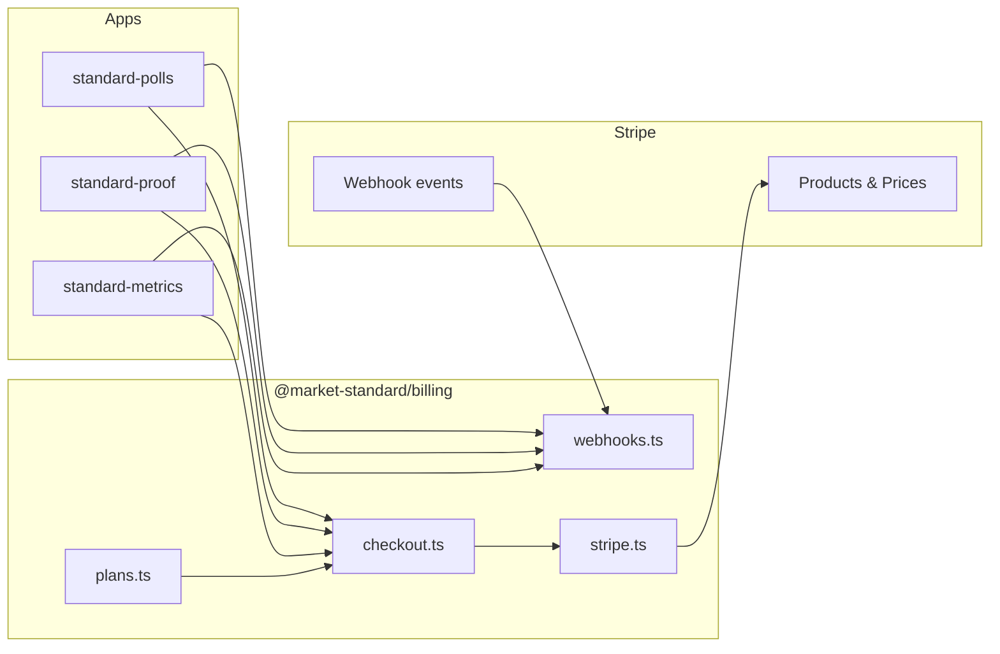
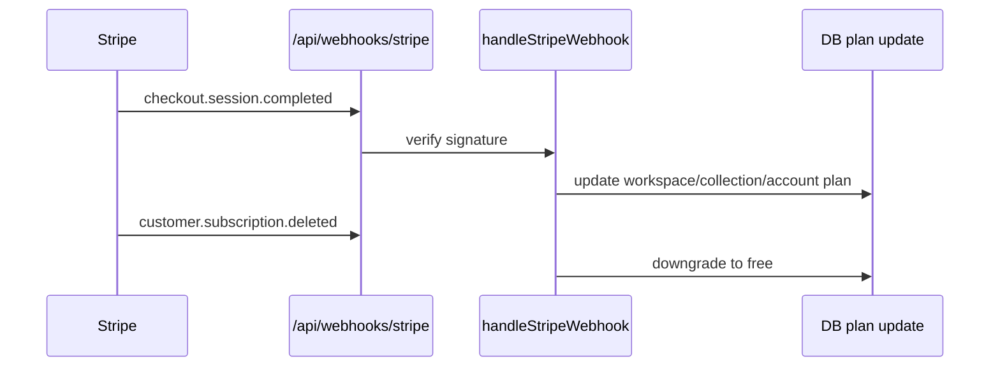

# @market-standard/billing

Shared **Stripe billing** utilities: plan definitions, checkout session creation, and webhook handling for all three Market Standard products.

## Purpose

- Centralize tier limits (polls/month, collections, history days)
- Single Stripe account, **per-product** prices and webhooks
- Enforce **powered-by badge** rules via `showBadge` on each plan

## Architecture



### Webhook flow



## Plan definitions

Defined in `src/plans.ts`:

| Product | Free | Starter | Growth |
|---------|------|---------|--------|
| **Polls** | 10 polls/mo, badge | $19, 100 polls, no badge | $49, unlimited |
| **Proof** | 1 collection, 10 quotes, badge | $19, 3 collections, 50 quotes | $49, unlimited |
| **Metrics** | 30-day history | $29, 1-year history | $79, unlimited + segments |

```typescript
import { PLANS, getPlan, type ProductId } from "@market-standard/billing";

const tiers = PLANS["standard-polls"];
const starter = getPlan("standard-polls", "starter");
```

## Exports

| Module | Key exports |
|--------|-------------|
| `plans` | `PLANS`, `PlanDefinition`, `getPlan()` |
| `checkout` | `createCheckoutSession()` |
| `webhooks` | `handleStripeWebhook()`, event types |
| `stripe` | configured Stripe SDK instance |

## Environment variables

Used by consuming apps (not this package directly):

```env
STRIPE_SECRET_KEY=sk_test_...
STRIPE_WEBHOOK_SECRET=whsec_...
NEXT_PUBLIC_STRIPE_PUBLISHABLE_KEY=pk_test_...
```

Map Stripe Price IDs into `plans.ts` `stripePriceId` fields when products are created in Dashboard.

## Integration per app

Each app exposes:

```
POST /api/webhooks/stripe  →  handleStripeWebhook(request, productId)
```

Product-specific logic (which table to update) lives in the webhook handler stub in each app.

## Testing

No automated tests yet. Manual Stripe CLI:

```bash
stripe listen --forward-to localhost:3001/api/webhooks/stripe
stripe trigger checkout.session.completed
```

Verify signature validation rejects unsigned payloads:

```bash
curl -X POST http://localhost:3001/api/webhooks/stripe -d '{}'   # expect 400
```

## Build

```bash
pnpm --filter @market-standard/billing build
```

## File layout

```
packages/billing/src/
├── plans.ts       Tier definitions + limits
├── checkout.ts    Stripe Checkout sessions
├── webhooks.ts    Event dispatch + verification
├── stripe.ts      Stripe client singleton
└── index.ts
```
