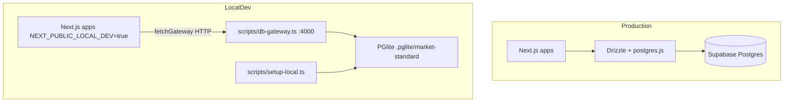
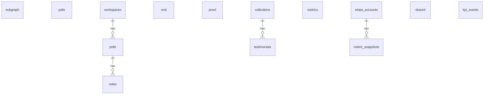

# @market-standard/db

Shared database layer for the Market Standard monorepo: **Drizzle ORM schemas**, Supabase client, Postgres connection, and **local PGlite development** via an HTTP gateway.

## Purpose

- Single source of truth for Postgres table definitions across three products
- Namespace isolation via Postgres schemas (`polls`, `proof`, `metrics`, `shared`)
- Local dev without Supabase: PGlite persisted to `.pglite/market-standard`
- Gateway pattern so Next.js apps never bundle PGlite WASM

## Architecture



### Schema layout



## Package exports

| Import path | Contents |
|-------------|----------|
| `@market-standard/db` | `getDb()`, `getDbAsync()`, `fetchGateway()`, `isLocalGatewayMode()` |
| `@market-standard/db/schema/polls` | `workspaces`, `polls`, `votes` |
| `@market-standard/db/schema/proof` | `collections`, `testimonials` |
| `@market-standard/db/schema/metrics` | `stripe_accounts`, `metric_snapshots` |
| `@market-standard/db/schema/shared` | `kpi_events` |
| `@market-standard/db/query` | Re-export `drizzle-orm` operators (`eq`, `count`, etc.) |
| `@market-standard/db/gateway` | Gateway client only |

## Local development

### Setup and seed

```bash
# From repo root
pnpm db:setup

# Or from this package
pnpm db:setup
```

Creates `.pglite/market-standard`, pushes schema (best-effort), and seeds:

- **Polls:** 1 workspace, 1 poll
- **Proof:** `demo` collection, 3 testimonials
- **Metrics:** `acct_demo_local`, 7 days of snapshots (MRR ~$12,400)
- **Shared:** sample `kpi_events`

### DB gateway

```bash
# From repo root
pnpm db:server
```

| Endpoint | Response |
|----------|----------|
| `GET /health` | `{ status, driver, port }` |
| `GET /polls/stats` | `{ workspaces, polls }` |
| `GET /proof/collections` | array of collections |
| `GET /proof/collections/:slug` | `{ collection, testimonials }` |
| `GET /metrics/dashboard` | `{ account, metrics }` |

### Gateway mode in apps

When `NEXT_PUBLIC_LOCAL_DEV=true`, app pages call `fetchGateway()` instead of `getDbAsync()`:

```typescript
import { fetchGateway, isLocalGatewayMode } from "@market-standard/db";

if (isLocalGatewayMode()) {
  const stats = await fetchGateway<{ workspaces: number }>("/polls/stats");
}
```

Set `DB_GATEWAY_URL=http://127.0.0.1:4000` in app `.env.local`.

## Production (Supabase)

```bash
cd packages/db
DATABASE_URL="postgresql://..." pnpm db:push
```

Create schemas first in Supabase SQL Editor:

```sql
CREATE SCHEMA IF NOT EXISTS shared;
CREATE SCHEMA IF NOT EXISTS polls;
CREATE SCHEMA IF NOT EXISTS proof;
CREATE SCHEMA IF NOT EXISTS metrics;
```

## Scripts

| Script | Command | Description |
|--------|---------|-------------|
| `db:setup` | `tsx scripts/setup-local.ts` | PGlite init + seed |
| `db:push` | `drizzle-kit push --force` | Push schema to DATABASE_URL |
| `db:generate` | `drizzle-kit generate` | Generate SQL migrations |
| `db:seed` | `tsx scripts/seed-local.ts` | Legacy socket seed (prefer `db:setup`) |

## File layout

```
packages/db/
├── src/
│   ├── schema/           polls.ts, proof.ts, metrics.ts, shared.ts
│   ├── index.ts          getDbAsync, exports
│   ├── local.ts          PGlite singleton
│   ├── gateway.ts        fetchGateway for Next apps
│   ├── client.ts         Supabase JS client
│   └── query.ts          drizzle-orm re-exports
├── scripts/
│   ├── setup-local.ts
│   └── seed-local.ts
└── drizzle.config.ts
```

## Testing

No unit tests yet. Verify manually:

```bash
pnpm db:setup
pnpm db:server &
curl http://127.0.0.1:4000/health
curl http://127.0.0.1:4000/polls/stats
curl http://127.0.0.1:4000/metrics/dashboard
pnpm typecheck
```

## Known issues

- `drizzle-kit push` with `DATABASE_DRIVER=pglite` may log a WASM abort on Windows (nested PGlite 0.2.x in drizzle-kit). Seeding still succeeds if schema already exists on disk.
- Do **not** import `@electric-sql/pglite` from Next.js app code — use the gateway.

## Build

```bash
pnpm --filter @market-standard/db build    # tsc --noEmit
```
