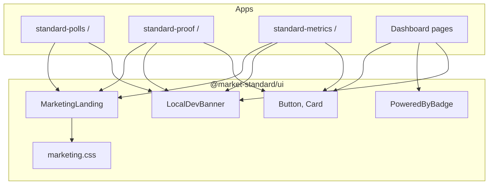
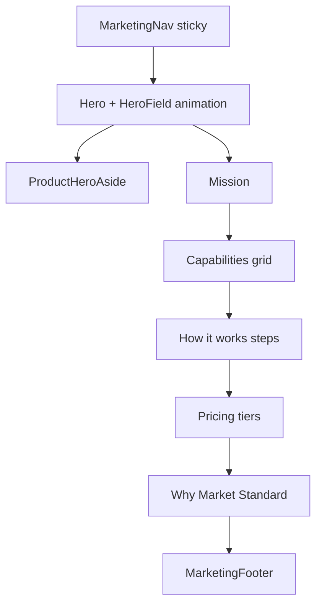

# @market-standard/ui

Shared React components and the **marketing one-pager system** for all Market Standard apps. Visual language inspired by [FloodG8](https://github.com/marketstandard/floodg8): dark abyss background, flood green (`#39ff14`), gilt gold accents, noise overlay, animated hero grid.

## Purpose

- Consistent UI primitives (Button, Card) across apps
- **Powered-by badge** — core viral loop component
- **MarketingLanding** — full one-pager layout for product home pages
- **LocalDevBanner** — cross-links local apps during PGlite dev

## Architecture



### MarketingLanding sections



## Exports

```typescript
import {
  Button,
  Card, CardHeader, CardTitle, CardDescription, CardContent,
  PoweredByBadge,
  LocalDevBanner,
  MarketingLanding,
  cn,
} from "@market-standard/ui";
```

| Export | Use |
|--------|-----|
| `MarketingLanding` | Product home `/` pages |
| `PoweredByBadge` | Viral footer on polls, embeds, public pages |
| `LocalDevBanner` | Shown when `NEXT_PUBLIC_LOCAL_DEV=true` |
| `Button`, `Card` | Dashboard layouts |
| `cn` | `clsx` + `tailwind-merge` helper |

## Marketing CSS

Import in each app's `globals.css`:

```css
@import "@market-standard/ui/marketing.css";
```

CSS variables are scoped under `.ms-marketing` (e.g. `--ms-flood`, `--ms-gilt`, `--ms-abyss`).

### Product hero asides

`ProductHeroAside` renders per-product demo panels:

| Product | Aside content |
|---------|---------------|
| `standard-polls` | Mock Slack `#product-feedback` poll |
| `standard-proof` | Three testimonial cards |
| `standard-metrics` | Rotating MRR orbit + metric pills |

## Usage example

```tsx
import { LocalDevBanner, MarketingLanding } from "@market-standard/ui";

export default function HomePage() {
  return (
    <>
      <LocalDevBanner />
      <MarketingLanding
        product="standard-polls"
        productLabel="Standard Polls"
        eyebrow="Market Standard · Slack engagement"
        headline={<>Every poll is a <span className="text-[var(--ms-flood)]">brand moment.</span></>}
        lede="Create interactive polls in Slack..."
        primaryCta={{ label: "Add to Slack", href: "/api/slack/oauth/install" }}
        stats={[{ value: "/poll", label: "slash command" }]}
        features={[...]}
        steps={[...]}
        pricing={[...]}
        proofPoints={[...]}
        missionTitle="..."
        missionBody="..."
        featuresTitle="..."
        stepsTitle="..."
        pricingTitle="..."
        proofTitle="..."
      />
    </>
  );
}
```

## File layout

```
packages/ui/src/
├── components/
│   ├── button.tsx
│   ├── card.tsx
│   ├── powered-by-badge.tsx
│   └── local-dev-banner.tsx
├── marketing/
│   ├── marketing.css
│   ├── marketing-landing.tsx
│   ├── marketing-nav.tsx
│   ├── marketing-footer.tsx
│   ├── hero-field.tsx
│   └── product-hero-aside.tsx
├── lib/utils.ts
└── index.ts
```

## Development

Tailwind must scan this package — each app's `tailwind.config.ts` includes:

```typescript
content: [
  "./src/**/*.{js,ts,jsx,tsx}",
  "../../packages/ui/src/**/*.{js,ts,jsx,tsx}",
],
```

## Testing

```bash
pnpm --filter @market-standard/ui typecheck
```

Manual: load each app home page and confirm dark marketing theme, hero animation, and footer sibling links.

## Build

```bash
pnpm --filter @market-standard/ui build   # tsc --noEmit
```

No runtime build step — apps import TypeScript source directly via workspace protocol.
